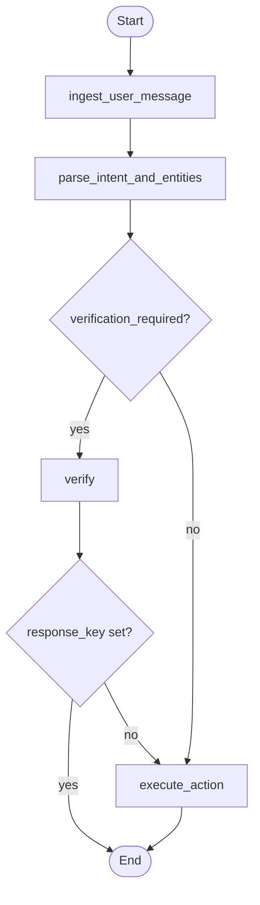

# Appointment Bot

Conversational appointment management service for a clinic workflow.

The main endpoint accepts natural language messages and lets a patient:

- verify their identity with full name, phone number, and date of birth
- list their appointments
- confirm an appointment
- cancel an appointment
- move naturally between these actions within the same conversation

## How This Project Was Built

I started from the exercise statement provided for the hiring process.

The first step was turning that prompt into a clearer working specification
through a discussion with `gpt-5.4`, using the PDF as the source of truth for
requirements, scope, flows, and constraints.

After that, I used GitHub's [`spec-kit`](https://github.com/github/spec-kit) to
structure the work as a spec-driven workflow. That process produced and guided
the following artifacts:

- project constitution
- feature specification
- implementation plan
- research notes
- data model
- API contract
- task breakdown

The main artifacts from that process live in:

- `specs/001-appointment-management/`
- `specs/002-frontend-llm-memory/`

## Architecture

This project is built with:

- Python 3.11+
- FastAPI
- LangGraph
- Pydantic
- Streamlit
- OpenAI Python SDK
- Langfuse Python SDK
- pytest

Key design decisions:

- a single `POST /chat` endpoint
- a `POST /sessions/new` bootstrap endpoint and a `POST /remembered-identity/forget` revoke endpoint
- explicit workflow orchestration with `LangGraph StateGraph`
- in-memory conversation state keyed by `thread_id`
- deterministic safety gates for verification and protected actions
- a lightweight Streamlit frontend for patient chat
- in-memory repositories for patients, appointments, and remembered identity

One alternative here would have been to use a ReAct-style agent. I chose an
explicit deterministic workflow instead because this problem is mostly a
stateful policy flow, not an open-ended tool-usage problem. In this healthcare
context, deterministic workflow was a better fit because verification gating,
appointment ownership, idempotent mutations, and lockout behavior stay
inspectable, testable, and resistant to prompt-injection-style failures.

Main structure:

```text
app/
  api/
  application/
  domain/
  evals/
  graph/
  infrastructure/
  llm/
  prompts/
frontend/
tests/
  api/
  evals/
  graph/
  unit/
docs/
specs/001-appointment-management/
specs/002-frontend-llm-memory/
```

Workflow graph:



Why deterministic workflow over a ReAct agent:

- The critical decisions in this exercise are policy decisions, not reasoning-heavy tool-selection decisions.
- Verification gating and appointment mutations need predictable control flow that is easy to test and audit.
- A ReAct loop would add more model authority than the problem requires, which is a worse trade-off for a healthcare-facing workflow.

## Important Business Rules

- listing, confirming, and canceling appointments only work after verification
- verification requires full name, phone number, and date of birth
- deferred protected actions resume automatically after successful verification
- confirmation and cancellation are idempotent
- the system avoids exposing another patient's data

## Environment Setup

### Requirements

- Python 3.11+
- `uv`

### Install dependencies

```bash
uv sync --extra dev
```

You can also rely on `uv run` if you prefer not to manage the virtual
environment manually.

### Configure environment

Copy the values you need from `.env.example`, then export the provider and tracing settings you want to use.

Minimum provider setup:

```bash
export OPENAI_API_KEY=your_key_here
export OPENAI_MODEL=gpt-4o-mini
```

Optional tracing setup:

```bash
export TRACING_ENABLED=true
export LANGFUSE_PUBLIC_KEY=your_public_key
export LANGFUSE_SECRET_KEY=your_secret_key
export LANGFUSE_HOST=https://cloud.langfuse.com
```

When running the full Docker Compose stack, local Langfuse credentials are
bootstrapped automatically unless you override them.

## Quickstart

### Run the full stack with Docker Compose

Make sure `OPENAI_API_KEY` is available in your shell, then start the stack:

```bash
docker-compose up --build
```

If your Docker installation supports the plugin-based CLI, this works too:

```bash
docker compose up --build
```

Then open:

- API: `http://localhost:8000`
- Swagger UI: `http://localhost:8000/docs`
- Streamlit: `http://localhost:8501`
- Langfuse: `http://localhost:3000`

The Compose stack starts:

- `api`
- `frontend`
- `langfuse-web`
- `langfuse-worker`
- `langfuse-postgres`
- `langfuse-clickhouse`
- `langfuse-minio`
- `langfuse-redis`

Default local Langfuse bootstrap values:

- Email: `admin@appointment-bot.local`
- Password: `appointment-bot-dev`
- Public key: `lf_pk_local_dev_key`
- Secret key: `lf_sk_local_dev_key`

By default, the API container points tracing at the local Langfuse instance via
`http://langfuse-web:3000`. Override `TRACING_ENABLED`, `LANGFUSE_HOST`,
`LANGFUSE_PUBLIC_KEY`, and `LANGFUSE_SECRET_KEY` if you want to disable tracing
or send traces somewhere else.

### Valid chatbot inputs

The project uses seeded in-memory patient data from `app/infrastructure/persistence/in_memory.py`.
To complete identity verification in the chat UI, provide one of these exact
combinations when the bot asks for them:

- `Ana Silva` / `11999998888` / `1990-05-10`
- `Carlos Souza` / `11911112222` / `1985-09-22`

Example conversation for a successful verification:

1. `I want to see my appointments`
2. `Ana Silva`
3. `11999998888`
4. `1990-05-10`

After that, you can continue with messages like:

- `list my appointments`
- `confirm the first one`
- `cancel the first one`

If the full name, phone number, and date of birth do not match the same seeded
patient record, the bot returns `issue=invalid_identity` and restarts the verification
flow.

### Run locally without Docker

Start the API locally with:

```bash
uv run uvicorn app.main:app --reload
```

Start the frontend with:

```bash
uv run streamlit run frontend/streamlit_app.py
```

## Running Tests

Full suite:

```bash
uv run --extra dev pytest
```

By layer:

```bash
uv run --extra dev pytest tests/unit
uv run --extra dev pytest tests/graph
uv run --extra dev pytest tests/api
uv run --extra dev pytest tests/evals
```

Offline evaluation:

```bash
uv run python -m app.evals.runner
```

## Design Artifacts

Architecture documentation:

- `docs/architecture.md`
- `docs/llm-boundary.md`
- `docs/security.md`
- `docs/data-model.md`
- `docs/observability.md`
- `docs/evaluation.md`
- `docs/decisions.md`
- `docs/graph.md`
- `docs/test-scenarios.md`

Specification artifacts:

- `specs/001-appointment-management/spec.md`
- `specs/001-appointment-management/plan.md`
- `specs/001-appointment-management/research.md`
- `specs/001-appointment-management/data-model.md`
- `specs/001-appointment-management/contracts/chat-api.yaml`
- `specs/001-appointment-management/tasks.md`

## Notes

- The project is intentionally scoped to the exercise and uses simplified
  identity verification.
- There is no real EHR/EMR integration.
- Appointment, session, conversation, and remembered identity data remain in memory.

## Scaling Ideas

If this application needed to move beyond demo scope, the next improvements would be:

- stream token output from the backend to the frontend instead of waiting for full responses
- replace in-memory state with an external database or cache so sessions and remembered identity survive restarts
- move patient and appointment data to a real persistence layer instead of seeded demo data
- add background workers and queueing for slower downstream operations or audits
- add stronger auth, rate limiting, and production-grade observability around protected flows

## Future Improvements

A deliberate trade-off in this exercise was to not implement deterministic
fallback for LLM failures. Today, provider failures propagate instead of
degrading gracefully. This was kept intentionally to avoid adding more
branching and fallback complexity beyond the scope of the exercise.

In a production version, likely next steps would be:

- deterministic fallback for intent and entity extraction in well-covered cases
- stronger persistence for sessions, appointments, and remembered identity
- stronger evaluation and regression coverage for natural language understanding
- more production-grade error handling and operational resilience

## Additional Docs

- `docs/architecture.md` -- system overview, layered architecture, data flows
- `docs/llm-boundary.md` -- LLM provider boundary, intent extraction, presenter-based response generation
- `docs/security.md` -- verification gating, session validation, PII redaction
- `docs/data-model.md` -- domain models, state machine, persistence strategy
- `docs/observability.md` -- structured logging, Langfuse, trace events
- `docs/evaluation.md` -- eval framework, scenarios, judge modes
- `docs/decisions.md` -- architecture decision records
- `docs/graph.md` -- workflow graph diagram
