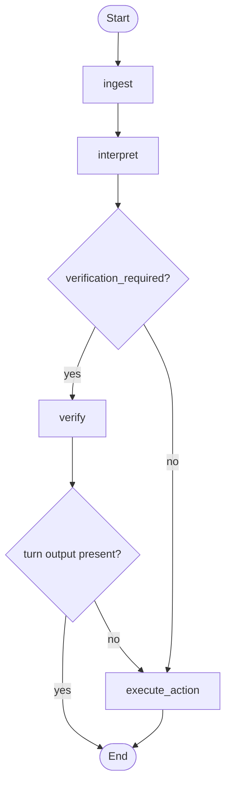

# Appointment Bot

A conversational appointment assistant for a clinic workflow.

The main endpoint understands natural language and helps a patient:

- verify their identity with full name, phone number, and date of birth
- list their appointments
- confirm an appointment
- cancel an appointment
- move naturally between these actions within the same conversation

Demo asset: [chat flow GIF](docs/demo-chat-flow.gif)

## How This Project Was Built

I started from the hiring-process exercise prompt and turned it into a working
specification, using the PDF as the source of truth for requirements, scope,
flows, and constraints.

After that, I used GitHub's [`spec-kit`](https://github.com/github/spec-kit) to
structure implementation as a spec-driven workflow. That process produced and
guided the following artifacts:

- project constitution
- feature specification
- implementation plan
- research notes
- data model
- API contract
- task breakdown

The main artifacts from that process live in:

- `specs/001-appointment-management/`
- `specs/002-frontend-llm-memory/`

After the initial spec implementation, I iterated with Cursor and GitHub
Copilot agents.

## Architecture

This project is built with:

- Python 3.11+
- FastAPI
- LangGraph
- Pydantic
- Streamlit
- OpenAI Python SDK
- Langfuse Python SDK
- pytest

Key design decisions:

- a single `POST /chat` endpoint
- a `POST /sessions/new` session-creation endpoint
- explicit workflow orchestration with `LangGraph StateGraph`
- SQLite-backed LangGraph checkpoint persistence via `SqliteSaver`
- in-memory session records in `InMemorySessionStore`
- deterministic safety gates for verification and protected actions
- a lightweight Streamlit frontend for patient chat
- in-memory repositories for patients and appointments

One alternative here would have been to use a ReAct-style agent. I chose an
explicit deterministic workflow instead because this problem is mostly a
stateful policy flow, not an open-ended tool-usage problem. In this healthcare
context, deterministic workflow was a better fit because verification gating,
appointment ownership, idempotent mutations, and lockout behavior stay
inspectable, testable, and resistant to prompt-injection-style failures.

Main structure:

```text
app/
  models.py
  repositories.py
  services.py
  responses.py
  runtime.py
  evals/
  graph/
  llm/
frontend/
tests/
  api/
  evals/
  graph/
  unit/
docs/
specs/001-appointment-management/
specs/002-frontend-llm-memory/
```

High-level workflow graph:



**How the graph works**

Each user message runs through four steps:

- **ingest** — resets per-turn output fields so the current turn starts clean. Persisted state (verification status, appointment history) is left untouched.
- **interpret** — the only step that calls the LLM. It classifies the user's intent and extracts any identity fields they provided. After this, all routing is deterministic.
- **verify** — the safety gate for protected operations. It collects missing identity fields one at a time, validates each one, and attempts the identity match when all three are present. If the user originally asked for an appointment action before being verified, that intent is stored as `deferred_operation` and resumed automatically once verification succeeds — the user never has to repeat themselves.
- **execute_action** — runs the actual business logic: listing appointments, confirming, or canceling. Only runs when verification already passed or was not required.

The graph is what makes the conversational flow predictable. Verification gating, deferred action resume, and routing decisions are all encoded in the graph, not inside LLM output. See [docs/graph.md](docs/graph.md) for a full walkthrough.

Why deterministic workflow over a ReAct agent:

- The critical decisions in this exercise are policy decisions, not reasoning-heavy tool-selection decisions.
- Verification gating and appointment mutations need predictable control flow that is easy to test and audit.
- A ReAct loop would add more model authority than the problem requires, which is a worse trade-off for a healthcare-facing workflow.

## Important Business Rules

- listing, confirming, and canceling appointments only work after verification
- verification requires full name, phone number, and date of birth
- deferred protected actions resume automatically after successful verification
- confirmation and cancellation are idempotent — meaning that performing the same action more than once produces the same result as performing it once. Confirming an already-confirmed appointment, or canceling an already-canceled one, leaves the system in exactly the same state and returns a consistent response instead of raising an error. This is useful because it makes retries safe: if a user sends the same request twice (by accident, or because they weren't sure the first one went through), the outcome is predictable and no duplicate side-effects occur
- the system avoids exposing another patient's data

## UX Scope Notes

- after successful verification, the intended UX is to show appointments automatically, so asking `list appointments` becomes optional for the happy path
- the explicit `list appointments` intent still exists and remains valid
- the current delivery supports one primary appointment action per user message

Messages that combine multiple mutations in one turn, such as `confirm the first and cancel the second`, are intentionally treated as out of scope for this exercise delivery. The reason is not that the behavior is unimportant, but that implementing it correctly would require broadening a design that is currently centered on one interpreted action and one main result per turn. For a hiring-process submission, keeping that boundary makes the workflow easier to reason about, test, and defend: the core value is deterministic verification-gated behavior, not maximizing conversational surface area in a single iteration.

## Environment Setup

### Requirements

- Python 3.11+
- `uv`

### Install dependencies

```bash
uv sync --extra dev
```

You can also rely on `uv run` if you prefer not to manage the virtual
environment manually.

### Configure environment

Copy the values you need from `.env.example`, then export the provider and tracing settings you want to use.

Minimum provider setup:

```bash
export OPENAI_API_KEY=your_key_here
export OPENAI_MODEL=gpt-4o-mini
```

Optional tracing setup:

```bash
export TRACING_ENABLED=true
export LANGFUSE_PUBLIC_KEY=your_public_key
export LANGFUSE_SECRET_KEY=your_secret_key
export LANGFUSE_HOST=https://cloud.langfuse.com
```

When running the full Docker Compose stack, local Langfuse credentials are
bootstrapped automatically unless you override them.

## Quickstart

### Run the full stack with Docker Compose

Make sure `OPENAI_API_KEY` is available in your shell, then start the stack:

```bash
docker-compose up --build
```

If your Docker installation supports the plugin-based CLI, this works too:

```bash
docker compose up --build
```

Then open:

- API: `http://localhost:8000`
- Health: `http://localhost:8000/health`
- Swagger UI: `http://localhost:8000/docs`
- Streamlit: `http://localhost:8501`
- Langfuse: `http://localhost:3000`

The Compose stack starts:

- `api`
- `frontend`
- `langfuse-web`
- `langfuse-worker`
- `langfuse-postgres`
- `langfuse-clickhouse`
- `langfuse-minio`
- `langfuse-redis`

Default local Langfuse bootstrap values:

- Email: `admin@appointment-bot.local`
- Password: `appointment-bot-dev`
- Public key: `lf_pk_local_dev_key`
- Secret key: `lf_sk_local_dev_key`

By default, the API container points tracing at the local Langfuse instance via
`http://langfuse-web:3000`. Override `TRACING_ENABLED`, `LANGFUSE_HOST`,
`LANGFUSE_PUBLIC_KEY`, and `LANGFUSE_SECRET_KEY` if you want to disable tracing
or send traces somewhere else.

### Valid chatbot inputs

The project uses seeded in-memory patient data from `app/repositories.py`.
To complete identity verification in the chat UI, provide one of these exact
combinations when the bot asks for them:

- `Ana Silva` / `11999998888` / `1990-05-10`
- `Carlos Souza` / `11911112222` / `1985-09-22`

Example conversation for a successful verification:

1. `I want to see my appointments`
2. `Ana Silva`
3. `11999998888`
4. `1990-05-10`

After that, you can continue with messages like:

- `list my appointments`
- `confirm the first one`
- `cancel the first one`

If the full name, phone number, and date of birth do not match the same seeded
patient record, the bot returns `issue=invalid_identity` and restarts the verification
flow.

### Run locally without Docker

Start the API locally with:

```bash
uv run uvicorn app.main:app --reload
```

Start the frontend with:

```bash
uv run streamlit run frontend/streamlit_app.py
```

## Running Tests

Full suite:

```bash
uv run --extra dev pytest
```

By layer:

```bash
uv run --extra dev pytest tests/unit
uv run --extra dev pytest tests/graph
uv run --extra dev pytest tests/api
uv run --extra dev pytest tests/evals
```

## Offline Evaluation

The project includes an in-repo offline evaluation runner for curated
multi-turn scenarios. It executes the conversation flows locally through the
application boundary and prints one JSON result per scenario.

This is useful because it complements the regular test suite with a
conversation-level review of the product behavior:

- it checks whether the assistant behaves correctly across several turns, not
  just within isolated units
- it makes it easier to catch regressions in verification, rerouting,
  ambiguity handling, and idempotency
- it gives you a judge summary and score for each scenario, which is helpful
  when reviewing prompt or workflow changes
- it does not require the API server or frontend to be running

Run it with:

```bash
uv run python -m app.evals.runner
```

`Offline` here means the eval harness runs directly inside the repo instead of
through the deployed app or UI. The judge still uses the configured LLM
provider, so you need a valid provider setup such as `OPENAI_API_KEY`.

## Documentation and Design Artifacts

The `docs/` folder collects the main architecture and delivery notes for the
project. These files are the best place to understand the design choices,
workflow boundaries, security model, and evaluation approach without reading the
code first.

- [`docs/architecture.md`](docs/architecture.md) - system overview, simplified architecture, and data flows
- [`docs/llm-boundary.md`](docs/llm-boundary.md) - LLM provider boundary, intent extraction, and deterministic response handling
- [`docs/security.md`](docs/security.md) - verification gating, session validation, and PII redaction
- [`docs/data-model.md`](docs/data-model.md) - domain models, workflow state, and persistence strategy
- [`docs/observability.md`](docs/observability.md) - structured logs, tracing, and Langfuse integration
- [`docs/evaluation.md`](docs/evaluation.md) - offline eval runner, scenarios, and judge flow
- [`docs/decisions.md`](docs/decisions.md) - architecture decision records
- [`docs/graph.md`](docs/graph.md) - workflow graph and routing notes
- [`docs/test-scenarios.md`](docs/test-scenarios.md) - manual test checklist and scenario coverage

Spec-driven implementation artifacts:

- `specs/001-appointment-management/spec.md`
- `specs/001-appointment-management/plan.md`
- `specs/001-appointment-management/research.md`
- `specs/001-appointment-management/data-model.md`
- `specs/001-appointment-management/contracts/chat-api.yaml`
- `specs/001-appointment-management/tasks.md`

## Notes

- The project is intentionally scoped to the exercise and uses simplified
  identity verification.
- There is no real EHR/EMR integration.
- Session records and seeded patient/appointment repositories remain in memory.
- LangGraph workflow checkpoints persist through SQLite via `SqliteSaver`.
- Cross-session remembered identity was intentionally left out of the delivered
  product to keep the implementation aligned with the original exercise scope.

## Scaling Ideas

If this application needed to move beyond demo scope, the next improvements would be:

- stream token output from the backend to the frontend instead of waiting for full responses
- move session storage and business repositories to external persistence and
  upgrade local SQLite checkpointing to production-grade managed storage
- move patient and appointment data to a real persistence layer instead of seeded demo data
- add background workers and queueing for slower downstream operations or audits
- add stronger auth, rate limiting, and production-grade observability around protected flows

## Future Improvements

Provider failures in the live `/chat` path are now surfaced as controlled HTTP 503 responses rather than unhandled exceptions. No deterministic intent-extraction fallback is implemented; if the provider fails, the request is aborted cleanly with a stable temporary-unavailable message. This keeps the error path simple and easy to reason about for an exercise-scope submission.

In a production version, likely next steps would be:

- cross-session remembered identity as an explicit scope expansion once the core flow no longer needs to stay exercise-sized
- deterministic fallback for intent and entity extraction in well-covered cases
- background or scheduled session cleanup instead of request-path lazy cleanup
- agent response streaming to deliver partial updates in real time and improve chat usability
- stronger persistence for sessions and appointments
- thread-safe shared state or externalized persistence instead of in-memory mutable stores
- stronger evaluation and regression coverage for natural language understanding
- more production-grade error handling and operational resilience
