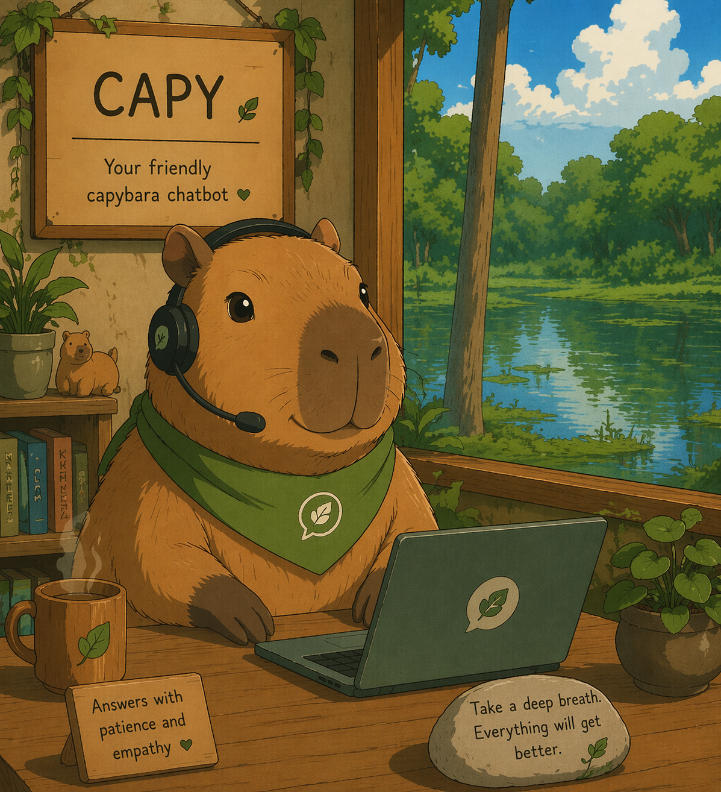
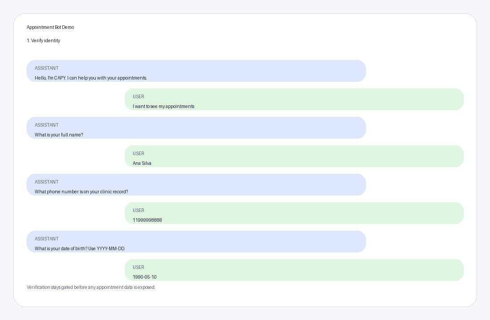

# CAPY Appointment Bot

<p align="center">
  
</p>

CAPY Appointment Bot is a take-home implementation of a clinic appointment assistant.
It lets a patient verify identity, list appointments, confirm an appointment,
and cancel an appointment in the same chat session.

I kept the workflow explicit on purpose. The hard part of this exercise is not
writing a chatbot that sounds clever. It is making sure verification,
appointment ownership, lockout behavior, and idempotent mutations stay
predictable.

Demo:

<p align="center">
  
</p>

## What it does

- verifies identity with full name, phone number, and date of birth
- lists appointments after verification
- confirms appointments
- cancels appointments
- lets the user move between those actions in one conversation
- exposes the flow through a FastAPI backend and a small Streamlit frontend

## Implemented features

- session-based chat flow
- identity verification with full name, phone, and date of birth
- protected appointment access after verification
- appointment listing
- appointment confirmation
- appointment cancellation
- multi-turn conversation flow with rerouting between actions
- bounded recent-message context to reduce context rot
- verification retry handling with lockout after repeated failed identity attempts
- Langfuse tracing and observability
- Streamlit demo frontend
- automated tests for core workflow and failure paths
- eval scenarios for multi-turn behavior and quality assurance

## Quickstart

### Requirements

- Python 3.11+
- `uv`
- `OPENAI_API_KEY`

### Run locally

This is the fastest way to review the project.

```bash
uv sync --extra dev
export OPENAI_API_KEY=your_key_here
export OPENAI_MODEL=gpt-4o-mini
uv run uvicorn app.main:app --reload
```

Then open:

- API docs: `http://localhost:8000/docs`
- Health check: `http://localhost:8000/health`

Optional frontend:

```bash
uv run streamlit run frontend/streamlit_app.py
```

### Run with Docker Compose

If you want the full local stack, including Streamlit and Langfuse:

```bash
docker compose up --build
```

That starts:

- API: `http://localhost:8000`
- Streamlit: `http://localhost:8501`
- Langfuse: `http://localhost:3000`

Local Langfuse login defaults:

- email: `admin@admin.com`
- password: `admin1234`

Tracing is already enabled by default in Docker Compose. If you run the API
outside Docker, set:

- `TRACING_ENABLED=true`
- `LANGFUSE_PUBLIC_KEY=lf_pk_local_dev_key`
- `LANGFUSE_SECRET_KEY=lf_sk_local_dev_key`
- `LANGFUSE_HOST=http://localhost:3000`

Inside Docker Compose, the API talks to Langfuse through the internal service
hostname `http://langfuse-web:3000`. Do not set `LANGFUSE_HOST=http://localhost:3000`
for the API container, because inside the container `localhost` points back to
the API container itself, not to Langfuse.

## Try it quickly

The project ships with seeded demo patients in `app/repositories.py`. These are
the two valid identity sets:

- `Ana Silva` / `11999998888` / `1990-05-10`
- `Carlos Souza` / `11911112222` / `1985-09-22`

A fast happy path looks like this:

1. `show my appointments`
2. `Ana Silva`
3. `11999998888`
4. `1990-05-10`
5. `confirm the first one`

After verification, the workflow shows the appointment list. From there the
patient can continue with messages like:

- `list my appointments`
- `confirm the first one`
- `cancel the first one`

If the name, phone, and date of birth do not belong to the same patient, the
bot returns `issue=invalid_identity` and restarts verification.

## Run tests

Full suite:

```bash
uv run --extra dev pytest
```

By area:

```bash
uv run --extra dev pytest tests/unit
uv run --extra dev pytest tests/graph
uv run --extra dev pytest tests/api
uv run --extra dev pytest tests/evals
```

Offline eval runner:

```bash
uv run python -m app.evals.runner
```

The eval runner replays multi-turn scenarios through the real workflow, prints
one result block per scenario, and saves machine-readable output under
`.eval_runs/`.

## Design choices

### Deterministic workflow over a free-form agent

I used LangGraph as an explicit workflow, not as an open-ended agent loop. The
model interprets the user's message, but policy decisions stay in Python.

That matters here because the risky parts are not creative tasks. They are
things like:

- whether the patient is verified
- whether an appointment belongs to that patient
- whether confirm or cancel should be idempotent
- whether the session should be locked after repeated failed verification

Those rules are easier to test and easier to explain when they are encoded in
the graph instead of hidden inside model behavior.

### The LLM has a narrow job

The live chat path uses the LLM for intent and entity extraction only.

The workflow uses the LLM output first and only fills simple missing fields
with deterministic parsing. If the provider call fails, the API returns HTTP
503 instead of falling back to a full parser.

It can suggest:

- `requested_operation`: the main action the user seems to want, such as `verify_identity`, `list_appointments`, `confirm_appointment`, `cancel_appointment`, `help`, or `unknown`
- `full_name`
- `phone`
- `dob`
- `appointment_reference`: the way the user points to a specific appointment, usually something like `1` in `confirm the first one`, but it can also be a date or explicit appointment id

It does not decide authorization, mutate appointments, or generate the final
patient-facing response. Final wording comes from deterministic response
templates in `app/responses.py`.

### Post-verification flow stays simple

After successful verification, the workflow moves the patient to
`list_appointments`.

### Storage is intentionally small

- patient and appointment data are seeded in memory
- session records live in `InMemorySessionStore`
- LangGraph checkpoints use `InMemorySaver`

This gives the project enough statefulness to show the workflow clearly without
dragging in a production persistence layer.

## Project shape

The main pieces are:

- `app/main.py`: FastAPI routes
- `app/runtime.py`: runtime wiring and dependency creation
- `app/graph/`: workflow nodes, state, parsing, and the LangGraph wrapper
- `app/services.py`: verification, appointment, and session services
- `app/repositories.py`: seeded in-memory repositories
- `app/responses.py`: deterministic response building from issues and action results
- `app/llm/`: OpenAI provider, schemas, and prompt
- `frontend/`: Streamlit chat UI
- `tests/`: unit, graph, API, and eval coverage

If you want more detail, start with:

- [`docs/architecture.md`](docs/architecture.md)
- [`docs/graph.md`](docs/graph.md)
- [`docs/security.md`](docs/security.md)
- [`docs/evaluation.md`](docs/evaluation.md)

## Scope

This project is intentionally exercise-sized and focused on the core appointment
workflow. A user starts a chat session, verifies identity, views appointments,
and can confirm or cancel one appointment. The goal is to keep the behavior
clear, deterministic, and easy to test, not to present a full production
healthcare system.

## Out of Scope

To keep the exercise focused, some production concerns were intentionally left out:

- real EHR or EMR integration (Electronic Health Record or Electronic Medical Record), meaning a connection to a real healthcare record system instead of seeded demo data
- production-grade authentication and authorization
- cross-session memory for returning users, so users are not remembered across separate sessions
- long-history compaction through summarization, so older conversation context is not condensed into a persistent summary
- handling multiple appointment actions in a single message. The bot should not understand commands like "confirm the first and cancel the second".
- production-grade persistence and background cleanup

Provider failures also currently propagate instead of degrading gracefully. In other words, the system returns a controlled failure instead of falling back to a reduced but still-available experience.

## Future Improvements

If extended further, likely next steps would be:

- deterministic fallback for intent and entity extraction in well-covered cases
- graceful degradation for provider failures, so the system can still offer a reduced experience when the LLM is unavailable, but not stop the system entirely. 
- cross-session memory for returning users, so stable user context can persist across separate conversations
- conversation history summarization to preserve relevant context while controlling token growth
- stronger persistence and operational hardening

## Documentation

The `docs/` folder has the main technical notes:

- [`docs/architecture.md`](docs/architecture.md): system layout and request flow
- [`docs/graph.md`](docs/graph.md): workflow behavior and routing
- [`docs/security.md`](docs/security.md): verification, lockout, ownership, and redaction
- [`docs/evaluation.md`](docs/evaluation.md): eval runner and scenarios

## Process notes

I used the exercise prompt as the source of truth and kept the planning
artifacts in:

- `specs/001-appointment-management/`
- `specs/002-frontend-llm-memory/`

I would not expect a reviewer to read those first. They are there if you want
to see the design trail.
