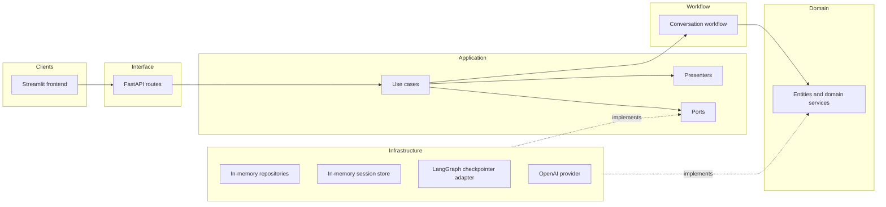
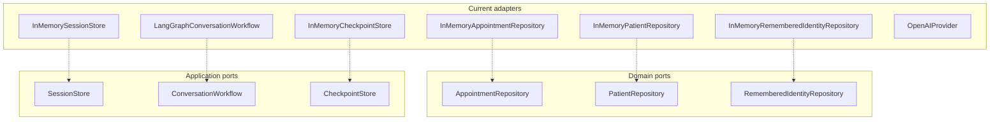
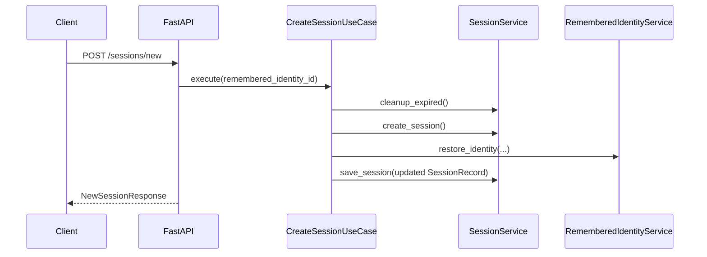
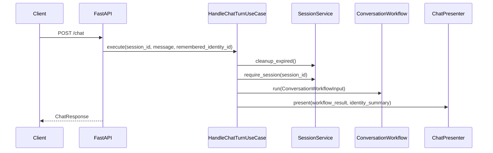

# Architecture

This document describes the current architecture of the conversational appointment management service after the application/workflow boundary refactor.

## 1. System Overview

The system is split into a browser-facing UI, a FastAPI delivery layer, explicit application use cases, a LangGraph-backed workflow runner, and in-memory infrastructure adapters. LLM inference and optional tracing remain out-of-process dependencies.

## 2. Layering

The codebase follows a Clean Architecture split with explicit use cases and workflow contracts.

### Domain

`app/domain/` contains clinic concepts only:
- value objects such as `FullName`, `Phone`, and `DateOfBirth`
- entities such as `Appointment`, `Patient`, and `RememberedIdentity`
- domain services such as `VerificationService`, `AppointmentService`, and `RememberedIdentityService`
- repository protocols in `app/domain/ports.py`

The domain no longer contains chatbot-specific action enums or public API result DTOs.

### Application

`app/application/` owns orchestration and boundary contracts:
- contracts in `app/application/contracts/`
- ports in `app/application/ports/`
- presenters in `app/application/presenters/`
- use cases in `app/application/use_cases/`
- session coordination in `app/application/session_service.py`

The primary use cases are:
- `CreateSessionUseCase`
- `HandleChatTurnUseCase`
- `ForgetRememberedIdentityUseCase`

### Workflow

`app/graph/` remains the deterministic conversation workflow package. It interprets intent, enforces verification, executes domain actions, and produces typed workflow outcomes. Response wording is no longer a graph node responsibility.

### Infrastructure

`app/infrastructure/` provides adapter implementations:
- `app/infrastructure/persistence/in_memory.py`
- `app/infrastructure/session/in_memory.py`
- `app/infrastructure/workflow/in_memory_checkpoint.py`
- `app/infrastructure/workflow/langgraph_runner.py`
- `app/infrastructure/llm/openai_provider.py`
- `app/infrastructure/llm/factory.py`

### Interface

`app/api/routes.py`, `app/api/schemas.py`, `app/main.py`, and the Streamlit frontend are now thin delivery adapters. They call use cases and render results rather than orchestrating workflow logic directly.

## 3. Port and Adapter Boundaries

The important architectural change is that `app/runtime.py` is now the only composition root. The workflow builder no longer creates default repositories, providers, settings, or tracers.

## 4. Request Lifecycle

### POST /sessions/new

`CreateSessionUseCase` creates the session record, restores remembered identity when applicable, and stores an optional one-shot `SessionBootstrap`.

### POST /chat

`HandleChatTurnUseCase` owns the application flow: session validation, workflow bootstrap, remembered identity update, and presentation.

### POST /remembered-identity/forget

`ForgetRememberedIdentityUseCase` delegates to `RememberedIdentityService.revoke_identity()` and returns a simple cleared flag.

## 5. Runtime Lifecycle

`create_runtime()` in `app/runtime.py`:
- loads `Settings`
- builds the logger and optional Langfuse tracer
- constructs the LLM provider via `app/infrastructure/llm/factory.py`
- creates in-memory repository, session, and checkpoint adapters
- constructs domain services
- compiles the graph with injected collaborators
- wraps the compiled graph in `LangGraphConversationWorkflow`
- wires presenters and application use cases

`RuntimeContext` now holds the use cases as first-class dependencies:
- `create_session_use_case`
- `handle_chat_turn_use_case`
- `forget_remembered_identity_use_case`

`app/main.py` still registers a lifespan that creates the runtime on startup and closes it on shutdown. `app/api/routes.py` reads `request.app.state.runtime` and lazily creates one only if needed.

## 6. Session and Workflow State

Session records are now stored through `SessionStore`, currently backed by `InMemorySessionStore`.

Each `SessionRecord` may contain a `SessionBootstrap` with a verified patient id restored from remembered identity. `HandleChatTurnUseCase` consumes this bootstrap and converts it into a `ConversationWorkflowInput`.

LangGraph checkpoint persistence is behind `CheckpointStore`, currently backed by `InMemoryCheckpointStore`.

## 7. File-to-Layer Mapping

| Layer | Files |
|---|---|
| Domain | `app/domain/models.py`, `app/domain/services.py`, `app/domain/ports.py`, `app/domain/errors.py` |
| Application | `app/application/contracts/*`, `app/application/ports/*`, `app/application/presenters/*`, `app/application/use_cases/*`, `app/application/session_service.py` |
| Workflow | `app/graph/builder.py`, `app/graph/routing.py`, `app/graph/state.py`, `app/graph/text_extraction.py`, `app/graph/nodes/*` |
| Infrastructure | `app/infrastructure/persistence/*`, `app/infrastructure/session/*`, `app/infrastructure/workflow/*`, `app/infrastructure/llm/*`, `app/observability.py` |
| Interface | `app/main.py`, `app/api/routes.py`, `app/api/schemas.py`, `frontend/streamlit_app.py`, `frontend/lib/api_client.py` |
| Cross-cutting | `app/config.py`, `app/runtime.py`, `app/prompts/*`, `app/evals/*` |
