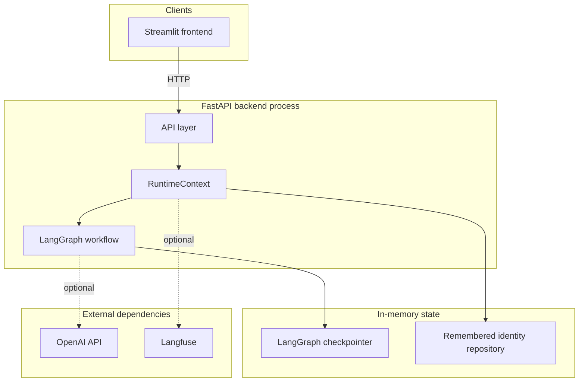
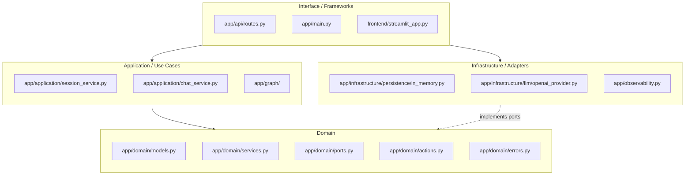
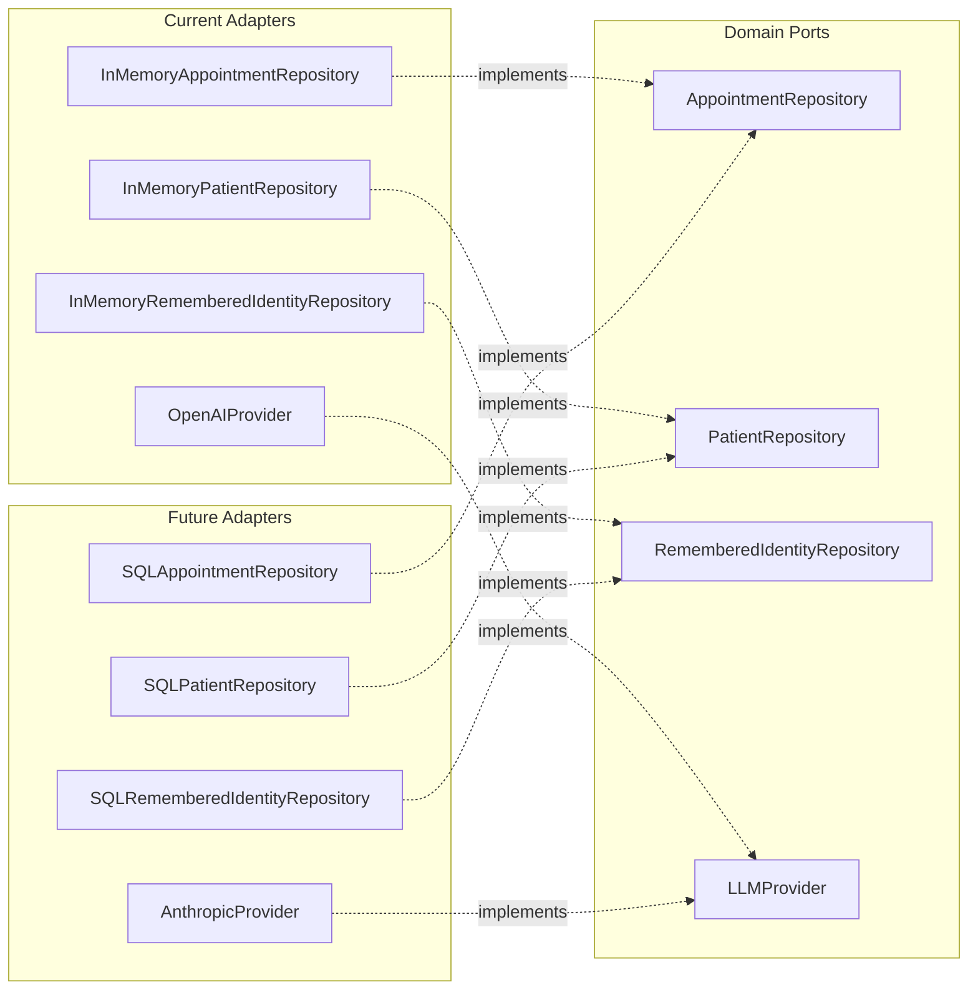
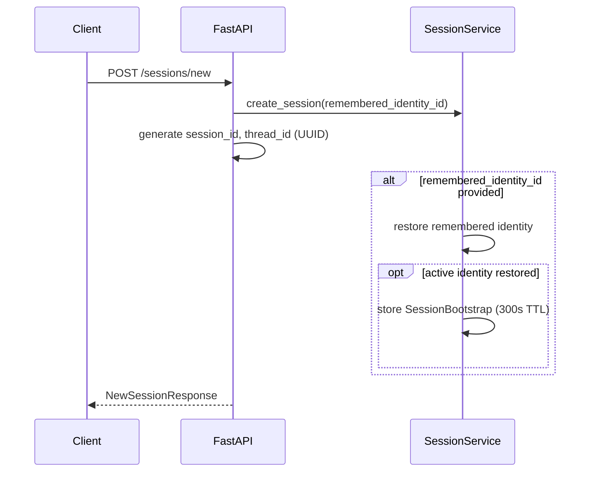
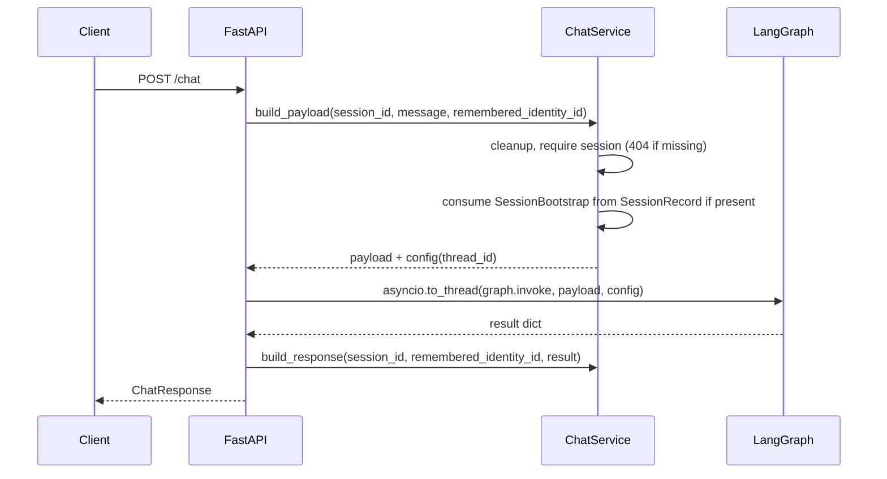
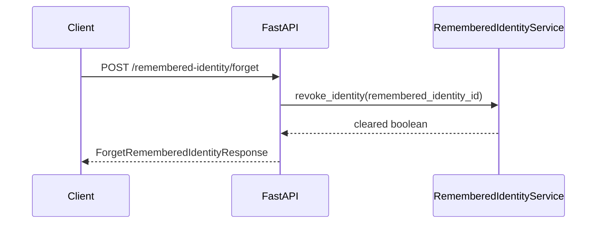

# Architecture

This document describes the architecture of the conversational appointment management service: a Python stack with FastAPI for HTTP, LangGraph for workflow orchestration, in-memory runtime state for sessions and remembered identity, and an optional Streamlit frontend.

## 1. System Overview

The system is split into a browser-facing UI, a FastAPI process, an embedded LangGraph runtime, and in-memory repositories held by the process. Large language model inference and optional tracing are out-of-process dependencies.

## 2. Clean Architecture

The refactored codebase follows four concentric layers. Dependencies point strictly inward: interface code can depend on application and domain code, infrastructure can implement domain ports, but the domain does not depend on infrastructure or frameworks.

### Dependency Rule

- The **domain** is the center of the system. It contains entities, value objects, domain services, domain exceptions, and repository protocols.
- The **application layer** orchestrates use cases such as session bootstrapping, remembered-identity restoration, and graph response mapping. It imports domain code but does not depend on FastAPI, Streamlit, or concrete persistence.
- The **infrastructure layer** implements domain ports with concrete adapters such as the in-memory repositories and the OpenAI-backed LLM provider.
- The **interface layer** owns HTTP and UI concerns only. `app/api/routes.py` delegates to application services and the LangGraph runtime rather than embedding the orchestration directly in route handlers.

### Port / Adapter Boundaries

Adding a new persistence or model provider adapter should only require a new implementation in `app/infrastructure/` plus wiring in `create_runtime()`. The domain and graph should not need to change for that substitution.

### Why this workflow instead of a ReAct agent

This exercise is a better fit for a deterministic workflow than for a ReAct loop. The core system decisions are verification gating, appointment ownership checks, lockout, and idempotent confirm or cancel behavior. Those are policy and state-transition concerns, so keeping them in explicit Python branches yields a smaller attack surface, more predictable behavior, and stronger tests. The LLM still adds value at the boundary for intent extraction and response wording, but it does not need to drive the control flow.

## 3. Request Lifecycle

### POST /sessions/new

Steps:

1. `SessionService.create_session()` generates a UUID `session_id`; `thread_id` matches `session_id` for checkpoint threading.
2. The service registers a `SessionRecord` with monotonic timestamps in its in-memory registry.
3. If `remembered_identity_id` is present, `RememberedIdentityService` attempts restore. If an active identity is restored, `SessionService` stores a one-time `SessionBootstrap` on the `SessionRecord` for the next chat turn.
4. The route returns `NewSessionResponse` produced from the service output.

### POST /chat

Steps:

1. `ChatService.build_payload()` validates the session exists via `SessionService`; missing sessions yield HTTP 404.
2. The service consumes at most one `SessionBootstrap` from that session record when building the payload. If there is no bootstrap but `remembered_identity_id` is sent on the request, the service may synthesize bootstrap state from a fresh restore.
3. It builds the graph payload: `thread_id`, `incoming_message`, plus optional bootstrap fields merged into state.
4. Run `await asyncio.to_thread(runtime.graph.invoke, payload, config)` with `configurable.thread_id` set to the session id.
5. `ChatService.build_response()` maps the graph result to public response fields (response text, verification flags, appointments, last action, errors).
6. `ChatService.ensure_remembered_identity()` makes sure verified sessions create or update remembered identity as appropriate; it attaches `remembered_identity_status` to the response.
7. Return `ChatResponse`.

### POST /remembered-identity/forget

Steps:

1. Delegate to `RememberedIdentityService.revoke_identity`.
2. Return whether the identity record was cleared.

## 4. Runtime Lifecycle

`create_runtime()` in `app/runtime.py` loads `Settings` via `load_settings()`, constructs the logger (`get_logger`), optional Langfuse-backed tracer (`build_tracer`), required LLM provider (`build_provider`), wires `InMemoryRememberedIdentityRepository` and `RememberedIdentityService`, creates `SessionService` and `ChatService`, and compiles the graph via `build_graph(...)`. The result is a `RuntimeContext` dataclass holding settings, logger, tracer, graph, provider, identity service, and the application services.

`app/main.py` registers an async lifespan: on startup it assigns `create_runtime()` to `app.state.runtime`; on shutdown it calls `close_runtime`.

`get_runtime` reads `request.app.state.runtime`, or lazily creates and stores a runtime if missing (useful for tests or atypical mounting).

`runtime.session_service.sessions` maps `session_id` to `SessionRecord`. `SessionService.cleanup_expired()` removes sessions whose `last_seen_at` is older than `settings.session_ttl_minutes` (default 60), using monotonic time. Chat handlers refresh `last_seen_at` on each authorized request via `SessionService.require_session()`.

Each `SessionRecord` may hold a `SessionBootstrap` value with a 300 second TTL from creation time; expired bootstrap state is cleared during cleanup. Bootstrap is consumed when the first eligible chat request builds its payload.

## 5. Deployment

**Local development:** run the API with `uv run uvicorn app.main:app` (or equivalent) and the UI with `uv run streamlit run frontend/streamlit_app.py`. Point the frontend at the API base URL (for example `http://localhost:8000` via `FRONTEND_API_BASE_URL`).

**Docker Compose:** `docker-compose.yml` defines `api` (Uvicorn on port 8000), `frontend` (Streamlit on port 8501), and a local Langfuse stack for tracing on port 3000. The application containers remain stateless, so restarting them resets sessions, conversation history, and remembered identity.

## 6. File-to-Layer Mapping

| Clean Architecture layer | Files |
|---|---|
| Domain (innermost) | `app/domain/models.py`, `app/domain/services.py`, `app/domain/ports.py`, `app/domain/actions.py`, `app/domain/errors.py` |
| Application | `app/application/session_service.py`, `app/application/chat_service.py`, `app/graph/builder.py`, `app/graph/routing.py`, `app/graph/state.py`, `app/graph/text_extraction.py`, `app/graph/nodes/*` |
| Infrastructure | `app/infrastructure/persistence/*`, `app/infrastructure/llm/*`, `app/observability.py` |
| Interface (outermost) | `app/main.py`, `app/api/routes.py`, `app/api/schemas.py`, `frontend/streamlit_app.py`, `frontend/lib/api_client.py` |
| Cross-cutting | `app/config.py`, `app/runtime.py`, `app/prompts/*`, `app/evals/*` |
