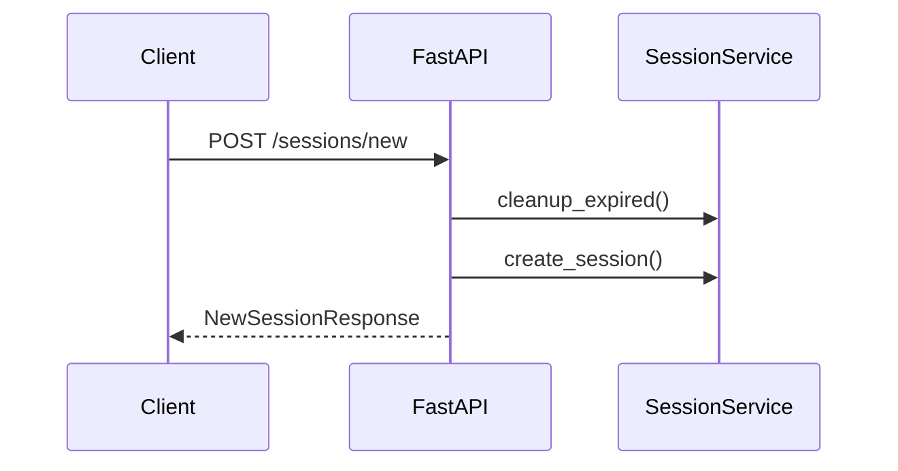
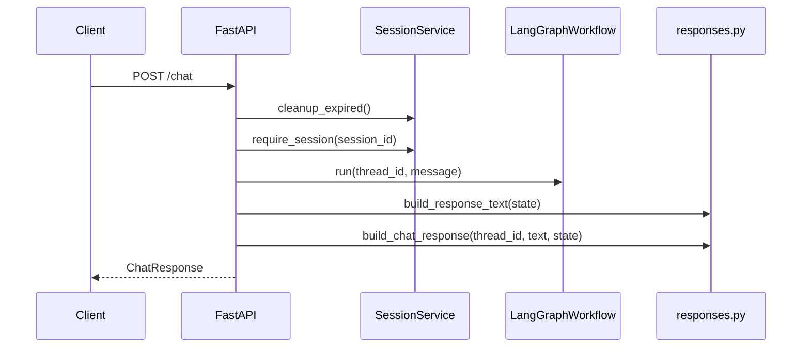

# Architecture

This guide walks through the simplified architecture of the conversational appointment service after the flattening refactor.

## 1. System Overview

The system is organized into a small set of explicit modules:

- `app/main.py` handles the FastAPI routes
- `app/runtime.py` wires the runtime
- `app/models.py` holds shared domain and API-facing models
- `app/repositories.py` contains the in-memory repositories and session store
- `app/services.py` contains verification, appointment, and session services
- `app/responses.py` builds deterministic user-facing responses
- `app/graph/` contains the LangGraph workflow
- `app/llm/` contains the OpenAI provider and typed schemas

```mermaid
flowchart LR
    subgraph clients [Clients]
        streamlit[Streamlit frontend]
    end

    subgraph delivery [Delivery]
        api[FastAPI app]
        runtime[Runtime wiring]
    end

    subgraph core [Core]
        models[Shared models]
        services[Business services]
        repos[In-memory repositories]
        responses[Deterministic responses]
    end

    subgraph workflowLayer [Workflow]
        graph[LangGraph workflow]
        parsing[Parsing helpers]
    end

    subgraph llmLayer [LLM]
        provider[OpenAI provider]
    end

    streamlit --> api
    api --> runtime
    api --> responses
    runtime --> repos
    runtime --> services
    runtime --> graph
    runtime --> provider
    graph --> services
    graph --> parsing
    graph --> models
    responses --> models
```

## 2. Module Responsibilities

### `app/models.py`

This is the shared type module. It contains:

- value objects such as `FullName`, `Phone`, and `DateOfBirth`
- entities such as `Appointment` and `Patient`
- enums such as `ConversationOperation`, `ResponseKey`, and `VerificationStatus`
- application errors and domain errors
- request and response DTOs such as `ChatRequest`, `ChatTurnResponse`, and `NewSessionResponseData`

### `app/repositories.py`

This file contains the concrete in-memory adapters used by the exercise:

- `InMemoryPatientRepository`
- `InMemoryAppointmentRepository`
- `InMemorySessionStore`

### `app/services.py`

This file contains the main business services:

- `VerificationService`
- `AppointmentService`
- `SessionService`

### `app/graph/`

The workflow remains deterministic and explicit:

- `builder.py` compiles the graph
- `state.py` defines the persisted conversation state
- `routing.py` contains the graph routing decisions
- `nodes.py` contains the graph node implementations
- `parsing.py` contains extraction and normalization helpers
- `workflow.py` wraps the compiled graph for runtime use

### `app/llm/`

The LLM boundary is intentionally small:

- `provider.py` contains `OpenAIProvider`
- `schemas.py` contains `IntentPrediction` and `JudgeResult`
- `prompt.py` contains the intent prompt

### Delivery

The delivery layer is now mostly two files:

- `app/main.py` for HTTP endpoints
- `app/runtime.py` for dependency wiring

There is no separate application, presenter, or runtime-assembly layer now.

## 3. Request Lifecycle

### POST /sessions/new



### POST /chat



## 4. Runtime Lifecycle

`create_runtime()` in `app/runtime.py` now does all composition directly:

- loads `Settings`
- builds the logger and optional Langfuse tracer
- builds a SQLite-backed LangGraph checkpointer with `SqliteSaver`
- creates the in-memory repositories
- creates `VerificationService`, `AppointmentService`, and `SessionService`
- creates the configured `OpenAIProvider`
- compiles the LangGraph workflow with the SQLite checkpointer
- exposes the resulting runtime through `RuntimeContext`

This is the only composition root in the project.

## 5. Session and Workflow State

- Session records are stored in `InMemorySessionStore`
- LangGraph thread state is persisted through the SQLite `SqliteSaver` checkpointer
- Verification, deferred actions, and appointment-list context live in `ConversationState`
- Cross-session remembered identity remains intentionally out of scope

## 6. File Mapping

| Area | Files |
|---|---|
| Delivery | `app/main.py`, `app/runtime.py`, `frontend/streamlit_app.py`, `frontend/lib/api_client.py` |
| Shared models | `app/models.py` |
| Services | `app/services.py` |
| Repositories | `app/repositories.py` |
| Responses | `app/responses.py` |
| Workflow | `app/graph/builder.py`, `app/graph/routing.py`, `app/graph/state.py`, `app/graph/nodes.py`, `app/graph/parsing.py`, `app/graph/workflow.py` |
| LLM | `app/llm/provider.py`, `app/llm/schemas.py`, `app/llm/prompt.py` |
| Cross-cutting | `app/config.py`, `app/observability.py`, `app/evals/*` |
