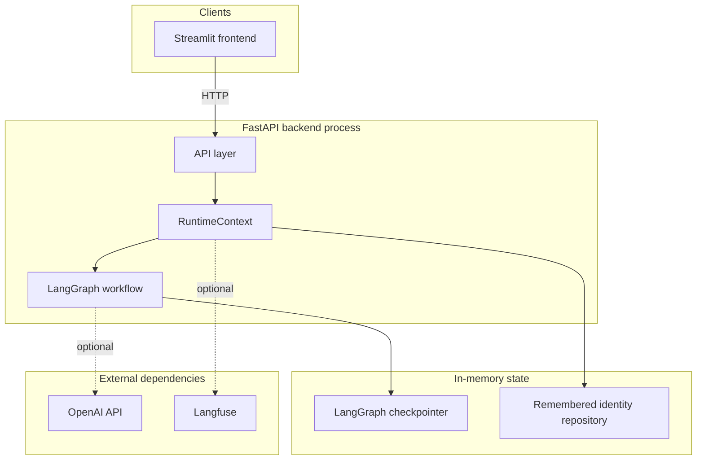
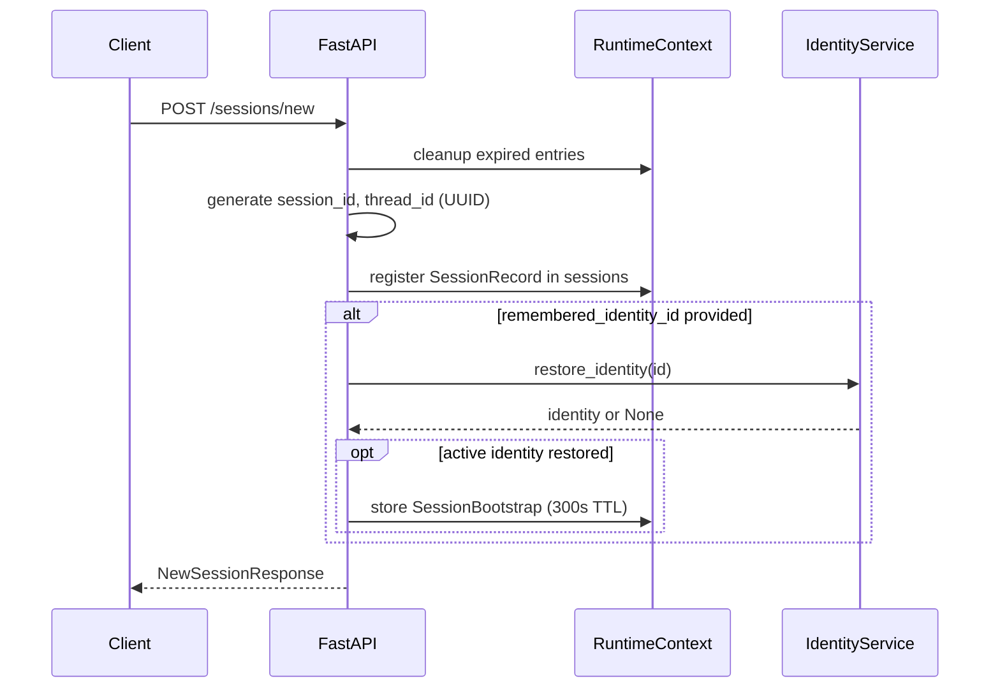
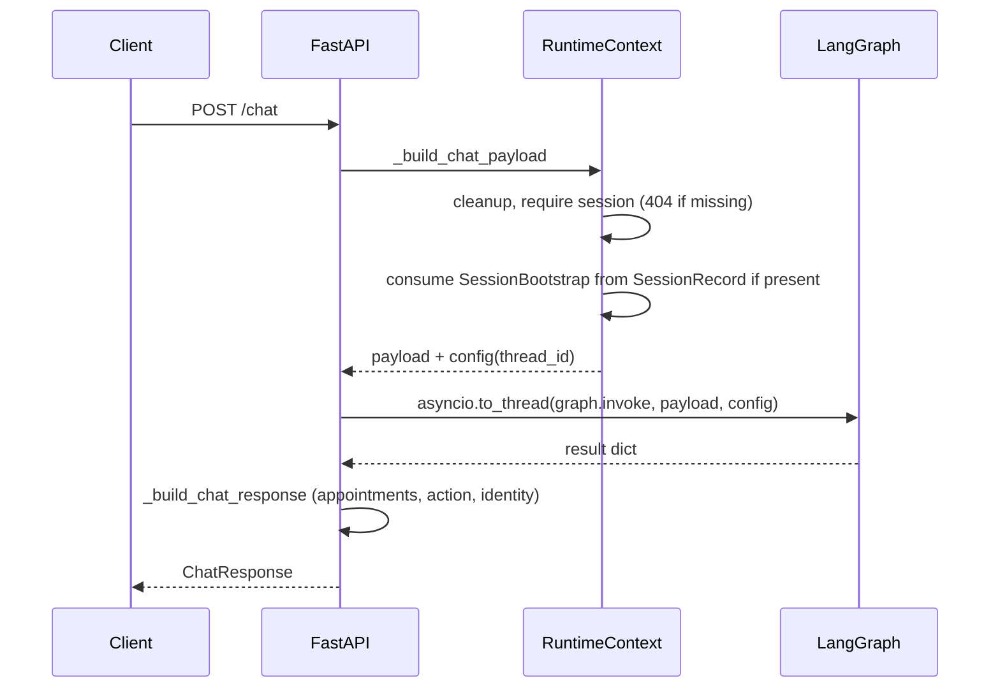
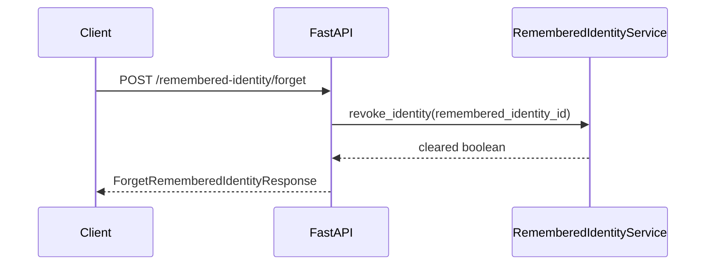

# Architecture

This document describes the architecture of the conversational appointment management service: a Python stack with FastAPI for HTTP, LangGraph for workflow orchestration, in-memory runtime state for sessions and remembered identity, and an optional Streamlit frontend.

## 1. System Overview

The system is split into a browser-facing UI, a FastAPI process, an embedded LangGraph runtime, and in-memory repositories held by the process. Large language model inference and optional tracing are out-of-process dependencies.

## 2. Layered Architecture

### HTTP layer

`app/api/routes.py` and `app/api/schemas.py` define FastAPI routes, Pydantic request and response models, and session validation. Dependencies resolve `RuntimeContext` via `Depends(get_runtime)`. The `POST /chat` endpoint runs the synchronous `graph.invoke` inside `asyncio.to_thread` so the asyncio event loop is not blocked. The layer maps HTTP concerns to graph payloads and responses; it does not embed business rules beyond validation and orchestration.

### Graph orchestration

`app/graph/` defines a LangGraph `StateGraph(ConversationState)` compiled with `InMemorySaver`. Nodes: `ingest_user_message`, `parse_intent_and_entities`, `verification_subgraph`, `list_appointments`, `confirm_appointment`, `cancel_appointment`, `handle_help_or_unknown`, `generate_response`. Conditional routing uses `route_after_interpret` after `parse_intent_and_entities` and `route_after_verification` after `verification_subgraph`. The graph is the workflow engine: it does not call HTTP, does not import FastAPI, and operates on state and injected services only.

### Domain services

`app/domain/` provides `VerificationService`, `AppointmentService`, and `RememberedIdentityService`. These encapsulate identity matching, idempotent appointment confirm and cancel semantics, and remembered-identity fingerprinting and lifecycle. They depend on repository protocols, not on storage technology or the graph.

### Repositories

`app/repositories/` defines protocol-style ports: patient, appointment, and remembered-identity repositories. Patient, appointment, and remembered-identity data use in-memory implementations for the demo.

### LLM boundary

`app/llm/` exposes an `LLMProvider` protocol with an `OpenAIProvider` implementation. The provider is used for intent extraction and response polishing in graph nodes, not for direct HTTP handling. The runtime requires a configured provider and fails fast at startup if the provider cannot be built. See `docs/llm-boundary.md` for scope and constraints.

## 3. Request Lifecycle

### POST /sessions/new

Steps:

1. Generate a UUID `session_id`; `thread_id` matches `session_id` for checkpoint threading.
2. Register a `SessionRecord` in `runtime.sessions` with monotonic timestamps.
3. If `remembered_identity_id` is present, attempt restore via `RememberedIdentityService`. If an active identity is restored, store a one-time `SessionBootstrap` on the `SessionRecord` for the next chat turn.
4. Return `NewSessionResponse` including greeting text and identity summary fields.

### POST /chat

Steps:

1. Validate the session exists via `runtime.sessions`; missing sessions yield HTTP 404.
2. Consume at most one `SessionBootstrap` from that session record when building the payload (one-time use). If there is no bootstrap but `remembered_identity_id` is sent on the request, the handler may synthesize bootstrap state from a fresh restore.
3. Build the graph payload: `thread_id`, `incoming_message`, plus optional bootstrap fields merged into state.
4. Run `await asyncio.to_thread(runtime.graph.invoke, payload, config)` with `configurable.thread_id` set to the session id.
5. Map the graph result to `ChatResponse` (response text, verification flags, appointments, last action, errors).
6. Call `_ensure_remembered_identity` so verified sessions create or update remembered identity as appropriate; attach `remembered_identity_status` to the response.
7. Return `ChatResponse`.

### POST /remembered-identity/forget

Steps:

1. Delegate to `RememberedIdentityService.revoke_identity`.
2. Return whether the identity record was cleared.

## 4. Runtime Lifecycle

`create_runtime()` in `app/runtime.py` loads `Settings` via `load_settings()`, constructs the logger (`get_logger`), optional Langfuse-backed tracer (`build_tracer`), required LLM provider (`build_provider`), wires `InMemoryRememberedIdentityRepository` and `RememberedIdentityService`, and compiles the graph via `build_graph(...)`. The result is a `RuntimeContext` dataclass holding settings, logger, tracer, graph, provider, identity service, and an empty `sessions` map.

`app/main.py` registers an async lifespan: on startup it assigns `create_runtime()` to `app.state.runtime`; on shutdown it calls `close_runtime`.

`get_runtime` reads `request.app.state.runtime`, or lazily creates and stores a runtime if missing (useful for tests or atypical mounting).

`runtime.sessions` maps `session_id` to `SessionRecord`. `_cleanup_expired_runtime_entries` removes sessions whose `last_seen_at` is older than `settings.session_ttl_minutes` (default 60), using monotonic time. Chat handlers refresh `last_seen_at` on each authorized request via `_require_session`.

Each `SessionRecord` may hold a `SessionBootstrap` value with a 300 second TTL from creation time; expired bootstrap state is cleared during cleanup. Bootstrap is consumed when the first eligible chat request builds its payload.

## 5. Deployment

**Local development:** run the API with `uv run uvicorn app.main:app` (or equivalent) and the UI with `uv run streamlit run frontend/streamlit_app.py`. Point the frontend at the API base URL (for example `http://localhost:8000` via `FRONTEND_API_BASE_URL`).

**Docker Compose:** `docker-compose.yml` defines `api` (Uvicorn on port 8000), `frontend` (Streamlit on port 8501), and a local Langfuse stack for tracing on port 3000. The application containers remain stateless, so restarting them resets sessions, conversation history, and remembered identity.

## 6. File-to-Layer Mapping

| Layer | Files |
|-------|-------|
| HTTP | `app/main.py`, `app/api/routes.py`, `app/api/schemas.py` |
| Runtime | `app/runtime.py`, `app/config.py` |
| Graph | `app/graph/builder.py`, `app/graph/routing.py`, `app/graph/state.py`, `app/graph/nodes/*` |
| Domain | `app/domain/models.py`, `app/domain/services.py`, `app/domain/policies.py` |
| Repositories | `app/repositories/*` |
| LLM | `app/llm/*`, `app/prompts/*` |
| Observability | `app/observability.py` |
| Evaluation | `app/evals/*` |
| Frontend | `frontend/streamlit_app.py`, `frontend/lib/api_client.py` |
