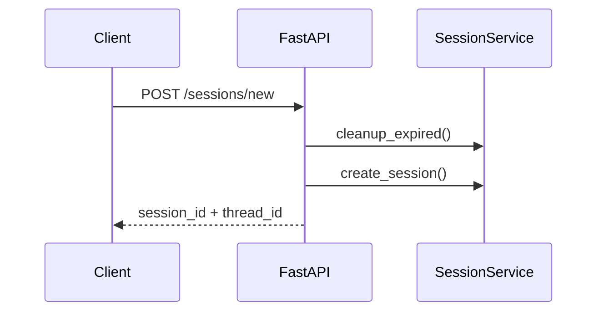
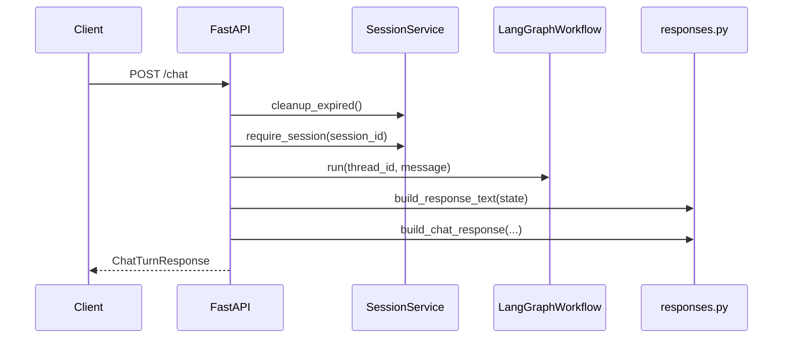

# Architecture

This project is small enough to follow without a giant diagram, which is a good
thing for a take-home. The code is split into a few clear layers:

- FastAPI for the HTTP API
- LangGraph for the conversation workflow
- services and repositories for business logic and demo data
- a small OpenAI provider for intent extraction and eval judging
- Streamlit for the optional frontend

## System layout

```mermaid
flowchart LR
    subgraph client [Client]
        streamlit[Streamlit frontend]
    end

    subgraph apiLayer [API]
        api[FastAPI app]
        runtime[Runtime wiring]
    end

    subgraph workflow [Workflow]
        graph[LangGraph workflow]
        parsing[Parsing helpers]
    end

    subgraph core [Core]
        services[Services]
        repos[Repositories]
        responses[Response builder]
        models[Shared models]
    end

    subgraph llm [LLM]
        provider[OpenAI provider]
    end

    streamlit --> api
    api --> runtime
    api --> responses
    runtime --> graph
    runtime --> services
    runtime --> repos
    runtime --> provider
    graph --> parsing
    graph --> services
    graph --> models
    responses --> models
```

## Main modules

### `app/main.py`

FastAPI entrypoint. It exposes:

- `POST /sessions/new`
- `POST /chat`
- `GET /health`

It also maps app-level failures to HTTP responses. The main example is provider
failure: if the LLM call fails during interpretation, the API returns HTTP 503.

### `app/runtime.py`

This is the composition root. It wires together:

- settings
- logger and optional tracer
- SQLite-backed LangGraph checkpointer
- in-memory repositories
- services
- OpenAI provider
- compiled workflow

There is no extra dependency-injection layer hiding things. For a project this
size, that would just add ceremony.

### `app/models.py`

Shared domain and API models live here:

- value objects such as `FullName`, `Phone`, and `DateOfBirth`
- domain entities such as `Patient` and `Appointment`
- enums such as `ConversationOperation`, `ResponseKey`, and `VerificationStatus`
- request and response DTOs
- domain and application errors

### `app/repositories.py`

The project uses seeded in-memory adapters:

- `InMemoryPatientRepository`
- `InMemoryAppointmentRepository`
- `InMemorySessionStore`

That is intentional. The goal here is to make the workflow easy to review, not
to spend the take-home on persistence plumbing.

### `app/services.py`

The services layer is narrow:

- `VerificationService`
- `AppointmentService`
- `SessionService`

These classes keep the graph focused on workflow decisions while the services do
the domain work.

### `app/graph/`

This is the center of the project.

- `builder.py` compiles the graph
- `state.py` defines workflow state
- `routing.py` holds routing predicates
- `nodes.py` contains the graph nodes
- `parsing.py` contains extraction helpers
- `workflow.py` wraps the compiled graph for runtime use

### `app/llm/`

The LLM boundary stays small:

- `provider.py` talks to OpenAI
- `schemas.py` defines typed structured outputs
- `prompt.py` contains the intent prompt

## Request flow

### `POST /sessions/new`



### `POST /chat`



## State and persistence

- session registry is in `InMemorySessionStore`
- conversation workflow state is persisted through SQLite via `SqliteSaver`
- patient and appointment data are seeded in memory

That mix is a little unusual, but it fits the exercise well. The workflow needs
real conversation state across turns, while the domain data only needs to be
good enough to demonstrate the flows.

## Why this shape works for the task

I kept coming back to one question: what does the reviewer actually need to
trust? Not that the bot sounds clever. They need to trust that protected actions
stay gated, that the flow is inspectable, and that the behavior is testable.

This structure supports that pretty well.
