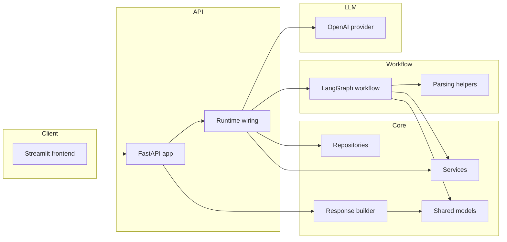
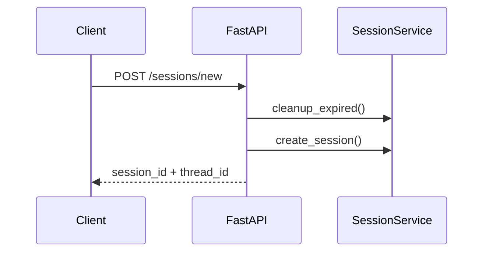
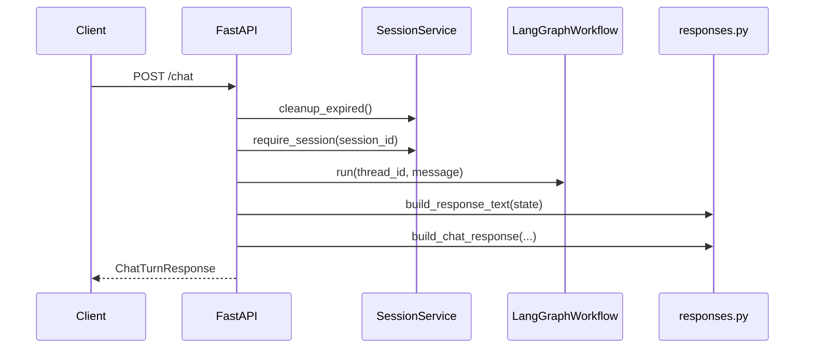
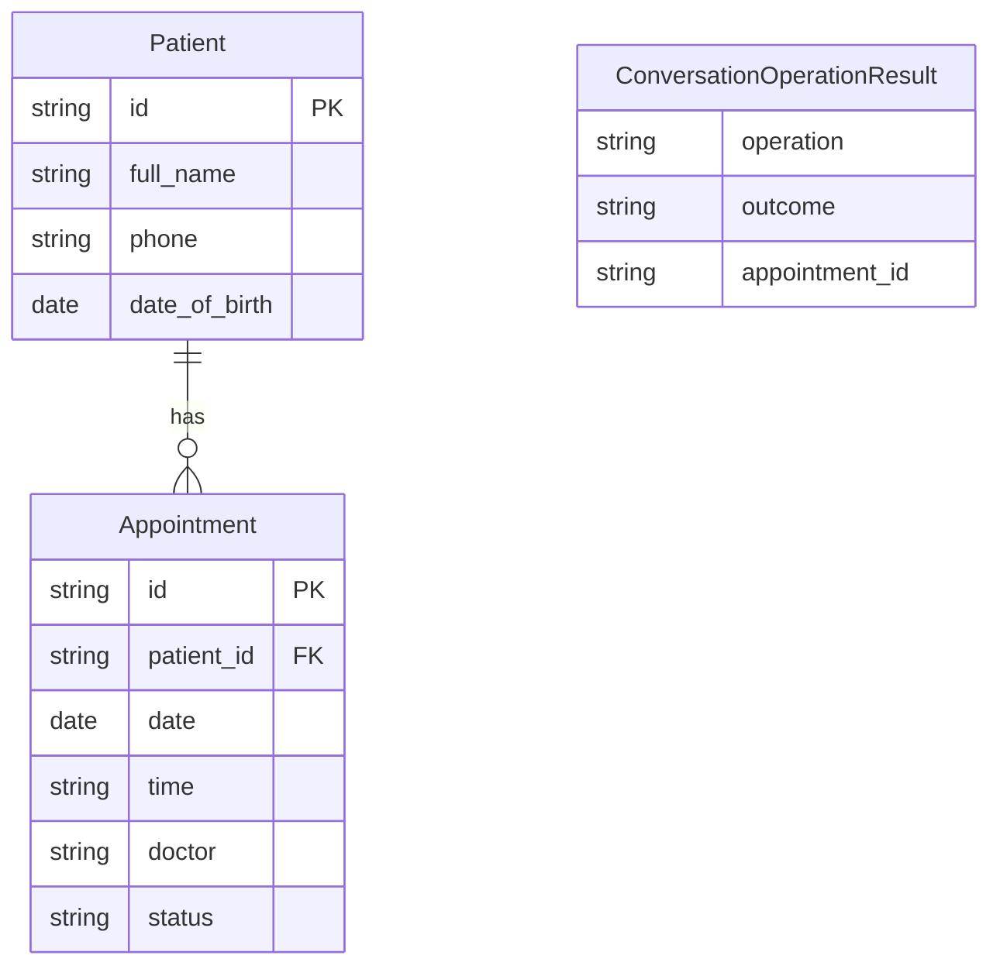
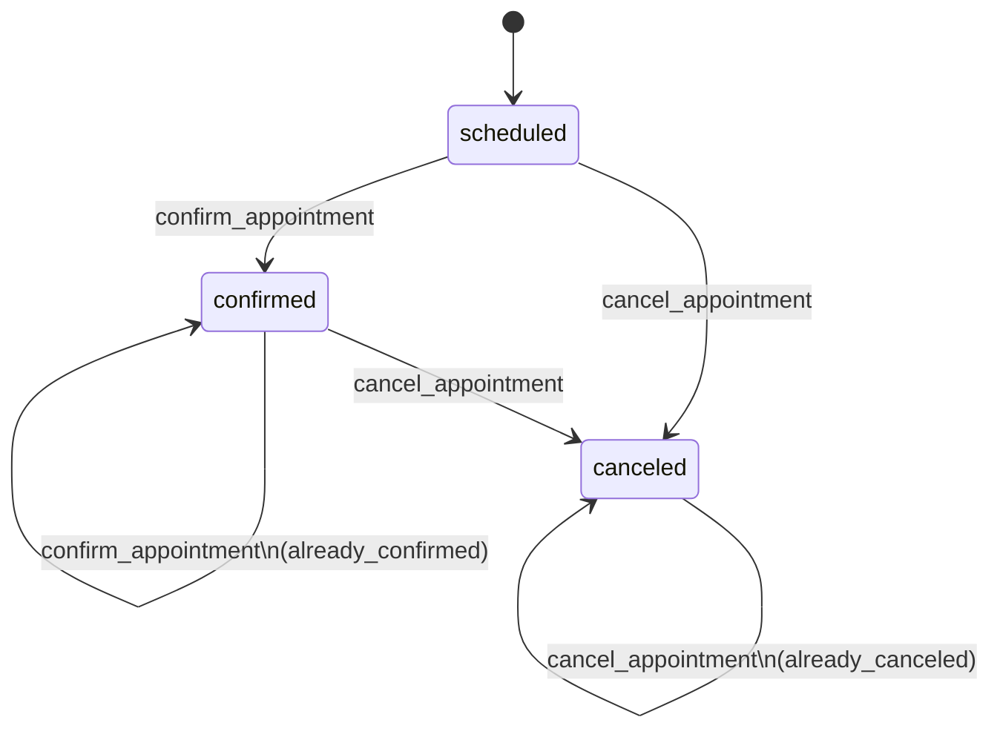

# Architecture

This project is small enough to follow without a giant diagram, which is a good
thing for a take-home. The code is split into a few clear layers:

- FastAPI for the HTTP API
- LangGraph for the conversation workflow
- services and repositories for business logic and demo data
- a small OpenAI provider for intent extraction and eval judging
- Streamlit for the optional frontend

## System layout

## Main modules

### `app/main.py`

FastAPI entrypoint. It exposes:

- `POST /sessions/new`
- `POST /chat`
- `GET /health`

It also maps app-level failures to HTTP responses. The main example is provider
failure: if the LLM call fails during interpretation, the API returns HTTP 503.

### `app/runtime.py`

This is the composition root. It wires together:

- settings
- logger and optional tracer
- in-memory LangGraph checkpointer
- in-memory repositories
- services
- OpenAI provider
- compiled workflow

There is no extra dependency-injection layer hiding things. For a project this
size, that would just add ceremony.

### `app/models.py`

Shared domain and API models live here:

- value objects such as `FullName`, `Phone`, and `DateOfBirth`
- domain entities such as `Patient` and `Appointment`
- enums such as `ConversationOperation`, `TurnIssue`, and `VerificationStatus`
- request and response DTOs
- domain and application errors

### `app/repositories.py`

The project uses seeded in-memory adapters:

- `InMemoryPatientRepository`
- `InMemoryAppointmentRepository`
- `InMemorySessionStore`

That is intentional. The goal here is to make the workflow easy to review, not
to spend the take-home on persistence plumbing.

### `app/services.py`

The services layer is narrow:

- `VerificationService`
- `AppointmentService`
- `SessionService`

These classes keep the graph focused on workflow decisions while the services do
the domain work.

### `app/graph/`

This is the center of the project.

- `builder.py` compiles the graph
- `state.py` defines workflow state
- `nodes.py` contains the graph nodes
- `parsing.py` contains extraction helpers
- `workflow.py` wraps the compiled graph for runtime use

### `app/llm/`

The LLM boundary stays small:

- `provider.py` talks to OpenAI
- `schemas.py` defines typed structured outputs
- `prompt.py` contains the intent prompt

## Request flow

### `POST /sessions/new`

### `POST /chat`

## State and persistence

- session registry is in `InMemorySessionStore`
- conversation workflow state uses LangGraph `InMemorySaver`
- patient and appointment data are seeded in memory

That mix is a little unusual, but it fits the exercise well. The workflow needs
real conversation state across turns inside a running process, while the domain
data only needs to be good enough to demonstrate the flows.

## Data model

The domain model is intentionally small.

There are two kinds of state in the project:

- domain data: patients and appointments
- workflow data: verification progress, turn output, and appointment-list context

### Entities

`ConversationOperationResult` is workflow output, not persisted domain data.

### Appointment status transitions

Repeated confirm and cancel are idempotent. That matters in chat because users
retry and repeat themselves.

## LLM boundary

The model is intentionally boxed in.

The live chat path uses the model for one thing:

- intent and entity extraction

The provider returns a structured prediction with:

- `requested_operation`
- `full_name`
- `phone`
- `dob`
- `selected_index`

The model does not:

- decide whether the patient is verified
- decide whether an appointment belongs to the patient
- confirm or cancel appointments directly
- choose final patient-facing wording
- control the workflow once interpretation is done

Those decisions stay in deterministic Python. The eval system also uses the
provider as a judge, but only in eval mode.

If `interpret()` fails after retries, the workflow raises
`DependencyUnavailableError` and the API returns HTTP 503. I intentionally left
out a heuristic fallback parser for this exercise.

## Observability

The app logs structured JSON events to stdout and can optionally send traces to
Langfuse. Tracing is optional and failures are isolated from the request path.

Each turn produces one Langfuse trace (keyed by `thread_id`) with spans for
node transitions, routing decisions, and LLM calls. All payloads redact PII
before logging or tracing (names, phone numbers, and dates of birth).

## Key decisions

The main architecture decisions for this project are:

- FastAPI for a small, reviewable API surface
- LangGraph for deterministic multi-turn workflow control
- LLM used only for interpretation, never for authorization or mutation
- deterministic final responses from `app/responses.py`
- in-memory workflow checkpoints and in-memory business repositories
- one main appointment action per user turn
