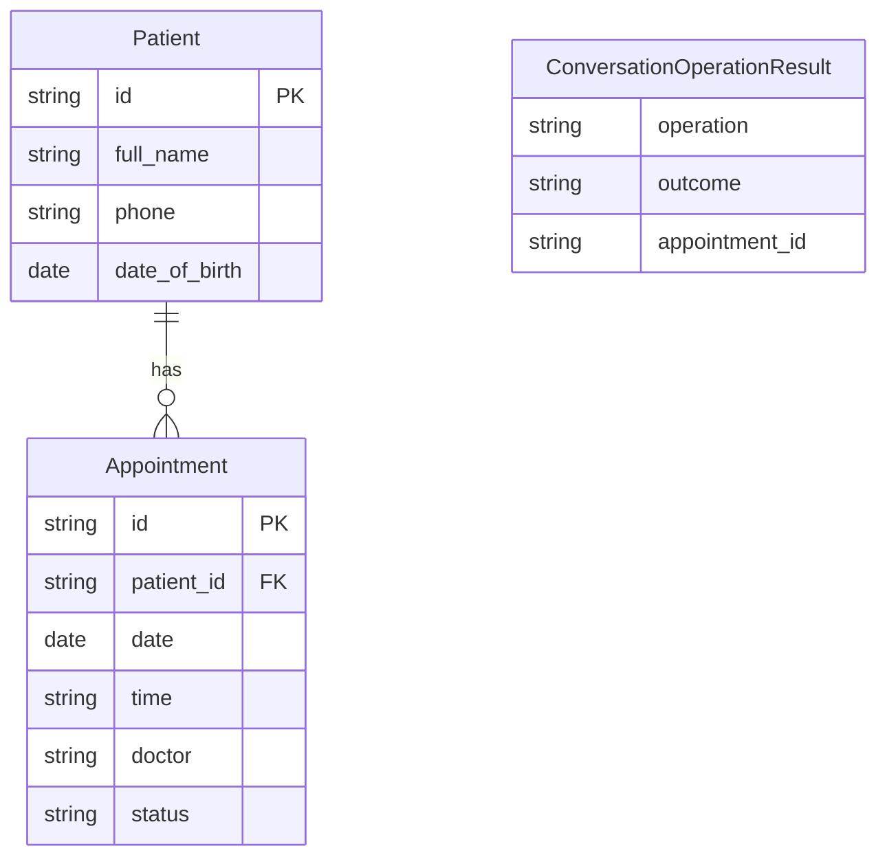
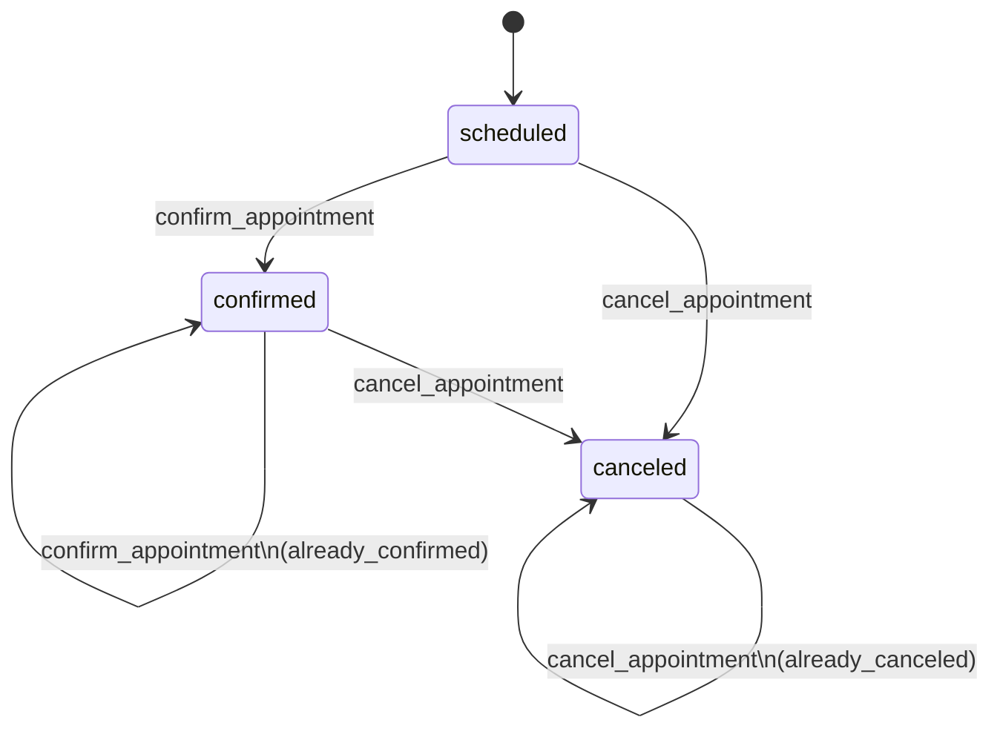

# Data model

The domain model is small. That helps.

There are really two kinds of state in this project:

- domain data: patients and appointments
- workflow data: verification progress, current turn output, and appointment-list context

## Entities

`ConversationOperationResult` is not persisted domain data. It is a workflow
result object that describes what happened in the current turn.

## Appointment status transitions

Two things matter here:

- confirm and cancel are state transitions
- repeated confirm and cancel are idempotent when the appointment is already in the target state

That second point is easy to miss in a chat workflow, but it matters. Users
repeat themselves. They retry. They double-tap. The system should stay calm.

## Workflow state

The graph keeps three state groups.

### Verification state

Tracks whether the patient is verified and how far they got in the identity
flow.

| Field | Purpose |
|---|---|
| `verified` | Whether verification succeeded |
| `verification_failures` | Failed identity-match attempts in this session |
| `verification_status` | `unverified`, `collecting`, `failed`, `verified`, or `locked` |
| `patient_id` | Matched patient after successful verification |
| `provided_full_name` | Collected full name |
| `provided_phone` | Collected phone |
| `provided_dob` | Collected date of birth |

### Turn state

Holds the output for the current turn.

| Field | Purpose |
|---|---|
| `requested_operation` | Operation currently being handled |
| `operation_result` | Result of a completed action, if any |
| `response_key` | Deterministic response selector |
| `issue` | Machine-readable issue for the turn |
| `subject_appointment` | Appointment touched by the turn, if any |

This state is reset at the start of each turn.

### Appointment state

Stores context that helps later turns make sense.

| Field | Purpose |
|---|---|
| `listed_appointments` | Last appointment list shown to the patient |
| `appointment_reference` | User reference such as `1`, a date, or an appointment id |

That is what makes messages like `confirm the first one` work after a prior
list.

## Persistence strategy

| Data | Storage | Lifetime |
|---|---|---|
| Patients | In-memory repository | Process lifetime |
| Appointments | In-memory repository | Process lifetime |
| Session registry | `InMemorySessionStore` | Process lifetime, TTL cleanup |
| Conversation workflow state | SQLite-backed LangGraph checkpointer | Survives process-level workflow access while the db file exists |

This is not a production data model. It is a delivery model for the exercise.
That trade-off is intentional.
