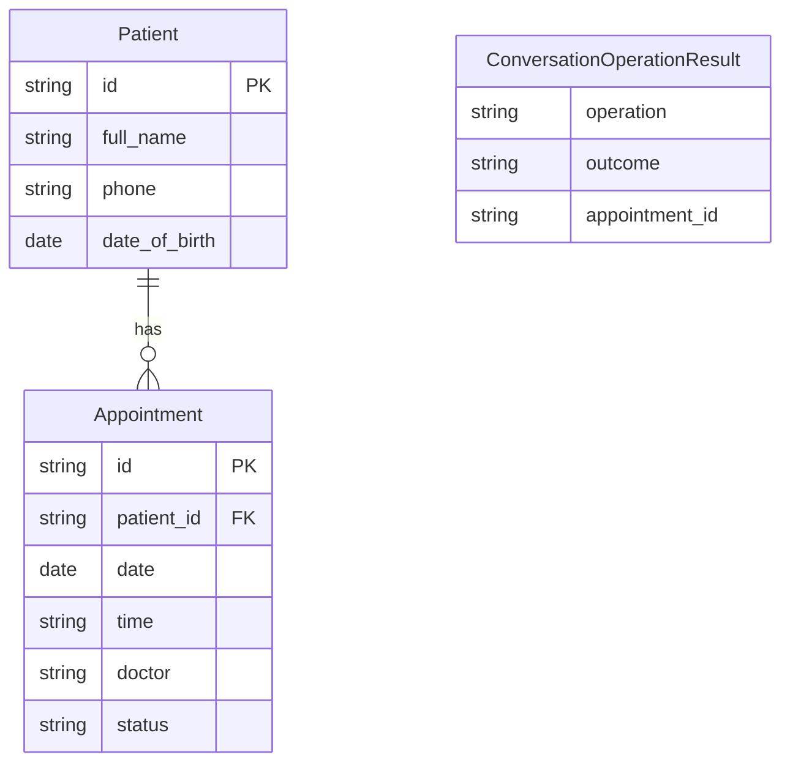
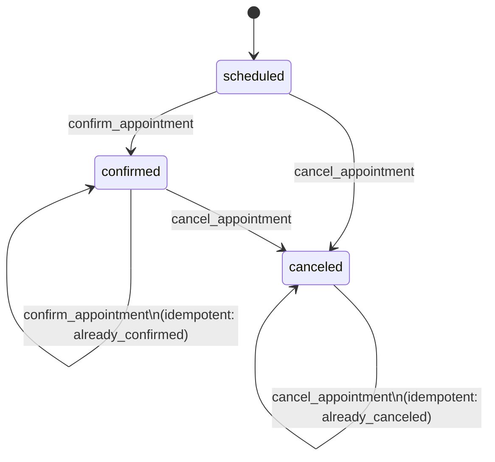

# Data model

## 1. Entity Relationships

`ConversationOperationResult` is an application/workflow contract that describes the outcome of a completed operation; it is not persisted.

## 2. AppointmentStatus State Machine

Confirming a `scheduled` appointment transitions to `confirmed`. Re-confirming an already `confirmed` appointment returns outcome `already_confirmed` without error. Canceling transitions `scheduled` or `confirmed` to `canceled`. Re-canceling an already `canceled` appointment returns outcome `already_canceled` without error. A `canceled` appointment cannot be confirmed.

## 3. ConversationState Reference

| Field | Type | Purpose |
|-------|------|---------|
| thread_id | str | Unique conversation thread identifier, same as session_id |
| incoming_message | str | Current user message being processed |
| messages | list[dict] | Full conversation history (role + content pairs) |
| verified | bool | Whether identity verification has succeeded |
| verification_failures | int | Count of failed verification attempts in this session |
| verification_status | `VerificationStatus` | Current phase: unverified, collecting, failed, verified, or locked |
| patient_id | str or None | Matched patient ID after successful verification |
| provided_full_name | str or None | Name provided by the patient during verification |
| provided_phone | str or None | Phone provided by the patient during verification |
| provided_dob | str or None | Date of birth provided by the patient during verification |
| requested_operation | `ConversationOperation` | Current operation being processed |
| deferred_operation | `ConversationOperation` or None | Protected operation deferred until verification completes |
| listed_appointments | list[Appointment] | Appointments returned by the last list action |
| appointment_reference | str or None | User's reference to a specific appointment (ordinal, date, id) |
| operation_result | `ConversationOperationResult` or None | Outcome of the last completed operation |
| response_key | `ResponseKey` or None | Deterministic presenter key for the patient-facing response |
| issue | `TurnIssue` or None | Machine-readable issue classification for the current turn |

## 4. Persistence Strategy

| Data | Storage | Lifetime |
|------|---------|----------|
| Patient records | In-memory (InMemoryPatientRepository) | Process lifetime |
| Appointment records | In-memory (InMemoryAppointmentRepository) | Process lifetime |
| Conversation state (per-thread) | In-memory via LangGraph InMemorySaver | Process lifetime |
| Session registry | In-memory via `InMemorySessionStore` | Process lifetime, TTL-based cleanup |

In-memory storage is intentional for demo scope. In production, conversation state, patient data, and appointment data should use external persistence.

Cross-session remembered identity is a possible future improvement, but it is intentionally not part of the delivered data model for this exercise.
