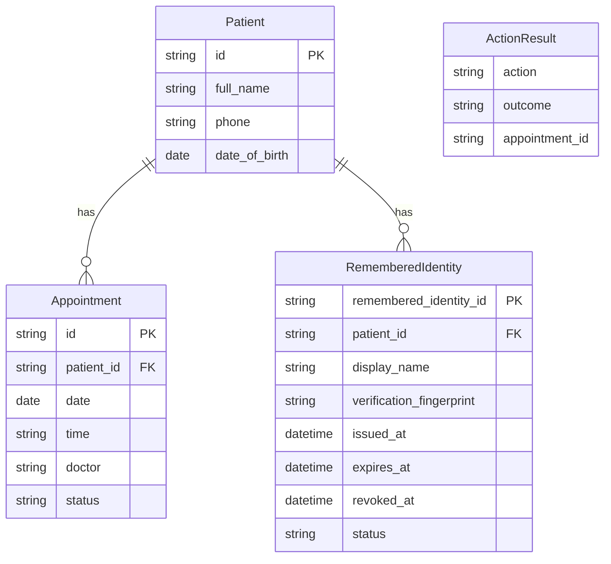
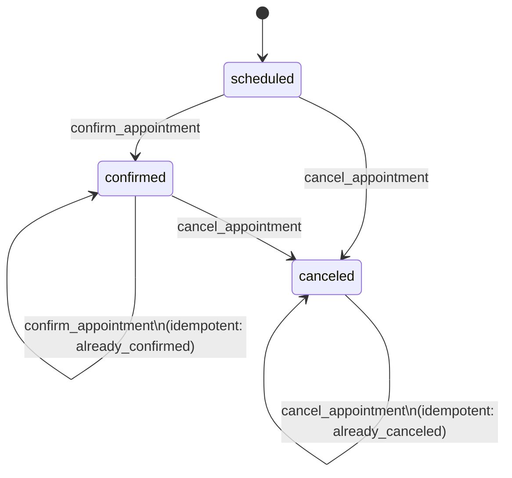
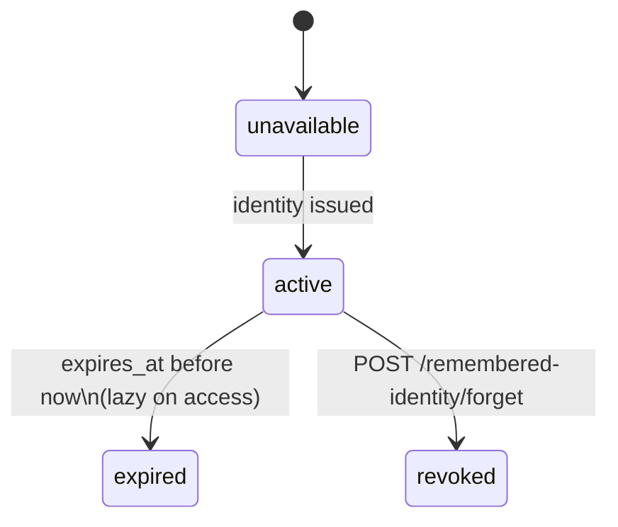

# Data model

## 1. Entity Relationships

`ActionResult` is a value object used in conversation flow; it is not persisted.

## 2. AppointmentStatus State Machine

Confirming a `scheduled` appointment transitions to `confirmed`. Re-confirming an already `confirmed` appointment returns outcome `already_confirmed` without error. Canceling transitions `scheduled` or `confirmed` to `canceled`. Re-canceling an already `canceled` appointment returns outcome `already_canceled` without error. A `canceled` appointment cannot be confirmed.

## 3. RememberedIdentityStatus Lifecycle

`unavailable` is the initial state when no remembered identity exists for the session.

## 4. ConversationState Reference

| Field | Type | Purpose |
|-------|------|---------|
| thread_id | str | Unique conversation thread identifier, same as session_id |
| incoming_message | str | Current user message being processed |
| messages | list[dict] | Full conversation history (role + content pairs) |
| verified | bool | Whether identity verification has succeeded |
| verification_failures | int | Count of failed verification attempts in this session |
| verification_locked | bool | Whether the session is locked due to too many failures |
| verification_status | str or None | Current phase: collecting, failed, verified, locked |
| patient_id | str or None | Matched patient ID after successful verification |
| provided_full_name | str or None | Name provided by the patient during verification |
| provided_phone | str or None | Phone provided by the patient during verification |
| provided_dob | str or None | Date of birth provided by the patient during verification |
| missing_verification_fields | list[str] | Fields still needed: full_name, phone, dob |
| requested_action | ActionName or None | Current action being processed |
| deferred_action | ActionName or None | Protected action deferred until verification completes |
| listed_appointments | list[Appointment] | Appointments returned by the last list action |
| appointment_reference | str or None | User's reference to a specific appointment (ordinal, date, id) |
| selected_appointment_id | str or None | Resolved appointment ID for confirm/cancel |
| last_action_result | dict or None | Outcome of the last appointment action |
| response_text | str or None | Text to return to the patient |
| error_code | str or None | Machine-readable error code for the current turn |
| provider_error | str or None | LLM provider error if one occurred |
| remembered_identity_id | str or None | Active remembered identity token |
| remembered_identity_status | dict or None | Summary of remembered identity state |

## 5. Persistence Strategy

| Data | Storage | Lifetime |
|------|---------|----------|
| Patient records | In-memory (InMemoryPatientRepository) | Process lifetime |
| Appointment records | In-memory (InMemoryAppointmentRepository) | Process lifetime |
| Conversation state (per-thread) | SQLite via LangGraph SqliteSaver | Persists across restarts |
| Remembered identity | SQLite (SQLiteRememberedIdentityRepository) | Persists across restarts, TTL + revoke |
| Session registry | In-memory (runtime.sessions dict) | Process lifetime, TTL-based cleanup |
| Session bootstrap | In-memory (runtime.session_bootstrap dict) | 300s TTL |

In-memory patient and appointment data is intentional for demo scope. A production system would back these with a database.
