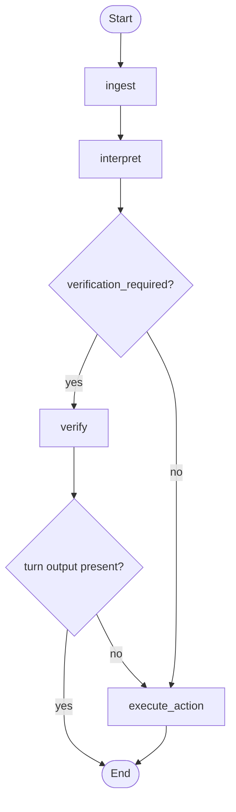

# Workflow graph

This is the core of the project.

If someone asks me what the interesting part of the take-home is, I would point
here first. The graph is where the system keeps its promises: verify first,
protect patient data, and keep the flow predictable across turns.

## Why use a graph at all?

This problem looks conversational, but it is mostly a policy flow.

The system has to answer questions like:

- is the patient verified yet?
- which identity field is still missing?
- should this turn prompt for more identity data or run a business action?
- can this appointment be confirmed or canceled?

Those are workflow questions, not creative-writing questions. A LangGraph
`StateGraph` fits that pretty naturally.

## Graph shape

Each user message makes one pass through this graph.

## Nodes

### `ingest`

Resets turn-level output fields so one turn does not leak into the next.

Without this step, old `response_key`, `issue`, or `operation_result` values
could stick around and produce stale responses.

### `interpret`

The only node that calls the LLM.

It extracts:

- `requested_operation`
- `full_name`
- `phone`
- `dob`
- `appointment_reference`

After that, the workflow is deterministic again.

If the provider fails here, the node raises `DependencyUnavailableError` and the
API returns HTTP 503.

### `verify`

This node owns the identity flow.

It:

- asks for missing fields one at a time
- validates field formats
- attempts the identity match when all three fields are present
- increments the failure counter on identity mismatch
- locks the session after the configured maximum number of failures

Once verification succeeds, the workflow sets the next operation to
`list_appointments` and continues.

### `execute_action`

Runs the business action once verification is no longer blocking the turn.

Depending on state, that may lead to:

- list appointments
- confirm an appointment
- cancel an appointment
- return help text

## Routing rules

After `interpret`, the graph asks one simple question: does this turn require
verification and is the patient still unverified?

- If yes, go to `verify`
- If no, go to `execute_action`

Protected operations are:

- `list_appointments`
- `confirm_appointment`
- `cancel_appointment`

The workflow also routes `help`, `unknown`, and `verify_identity` through
`verify` when the user is still in the middle of identity collection. That
sounds a little odd at first, but it works well in practice because users often
mix natural conversation with identity answers.

After `verify`, the graph checks whether the node already produced a turn
result.

- If yes, stop the turn there
- If no, continue to `execute_action`

That is why the system can ask for a missing phone number without also trying to
list appointments in the same turn.

## Example flow

### Listing before verification

1. User: `show my appointments`
2. `interpret` classifies `list_appointments`
3. `verify` asks for `full_name`
4. User provides name
5. `verify` asks for `phone`
6. User provides phone
7. `verify` asks for `dob`
8. User provides DOB
9. verification succeeds
10. `execute_action` lists appointments

### Confirm after listing

1. User: `confirm the first one`
2. `interpret` extracts `confirm_appointment` and `appointment_reference=1`
3. user is already verified, so the graph skips `verify`
4. `execute_action` resolves `1` against the stored appointment list
5. appointment is confirmed or returns an idempotent outcome if it was already confirmed

## What the graph does not do

- it does not build final HTTP responses
- it does not let the LLM decide policy
- it does not implement real authentication
- it does not replace the service layer

That boundary is deliberate. The graph owns workflow. The rest stays outside it.
