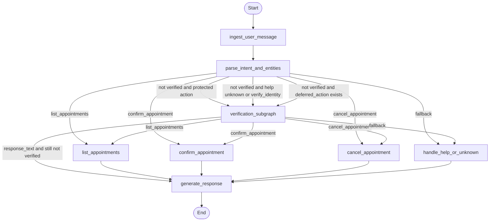

# Workflow Graph

## Notes

- The graph is compiled in `app/graph/builder.py` with `InMemorySaver`.
- `route_after_interpret()` sends the flow to `verification_subgraph` whenever the patient is not verified and the action is protected, is an early verification-style action, or a deferred action already exists.
- `route_after_verification()` goes straight to `generate_response` when verification still needs more data or the session is locked and a response is already prepared.
- Once verification succeeds, the graph resumes the intended action path without requiring the user to restate it.
- `generate_response` always stays after deterministic business logic so the LLM never controls authorization or state mutation.
