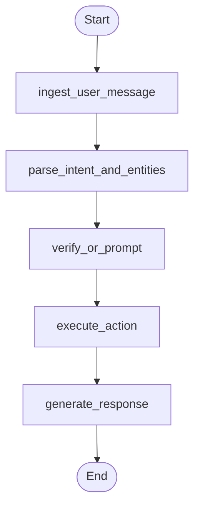

# Workflow Graph

## Notes

- The graph is compiled in `app/graph/builder.py` with `InMemorySaver`.
- `parse_intent_and_entities` extracts the structured action and entity fields, filling identity inputs when they can be safely normalized.
- `verify_or_prompt` is the single gatekeeper for protected actions: it either passes through, asks for the next verification field, returns a validation error, or locks the session after repeated failures.
- `execute_action` runs deterministic business logic for list, confirm, cancel, or help, and skips execution when verification already prepared the user-facing response for this turn.
- Once verification succeeds, the graph resumes the intended action path through `deferred_action` without requiring the user to restate it.
- `generate_response` always stays after deterministic business logic so the LLM never controls authorization or state mutation.
