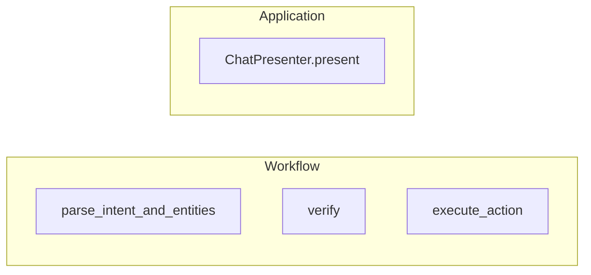

# LLM boundary

This document describes how language models participate in the appointment bot. The runtime is designed so that correctness, authorization, and state changes do not depend on nondeterministic model output.

## 1. Design principle

The LLM is non-authoritative. It performs exactly two product roles:

1. **Intent extraction** — parse the user message into a structured operation label and entity fields.
2. **Response polishing** — rewrite deterministic presenter fallback text into concise, patient-facing wording.

The model does not grant or deny access, does not mutate appointments or identity state, and does not decide graph routing. Those responsibilities stay in deterministic Python code paths. Security-sensitive and policy outcomes are computed from explicit rules and repository operations, not from free-form LLM text.

## 2. Provider protocol

`LLMProvider` in `app/llm/base.py` is a `Protocol` with three methods:

| Method | Role |
|--------|------|
| `interpret(message, state) -> IntentPrediction` | Propose `requested_operation`, `full_name`, `phone`, `dob`, `appointment_reference` from the message and a small state snapshot. |
| `generate_response(state, fallback_text) -> AssistantResponse` | Produce polished `response_text` from the deterministic `fallback_text` and state context. |
| `judge(scenario, transcript, observed_outcomes) -> JudgeResult` | Used by the evaluation harness; not part of the live chat graph. |

`IntentPrediction`, `AssistantResponse`, and `JudgeResult` are Pydantic models in `app/llm/schemas.py`. They constrain what the implementation may return and keep the boundary typed.

## 3. Factory pattern

`build_provider` in `app/infrastructure/llm/factory.py` constructs a concrete provider from `Settings`. It returns `OpenAIProvider` when `ProviderSettings.provider_name` is `"openai"` and `ProviderSettings.api_key` is present. Those values come from environment configuration (`LLM_PROVIDER` defaults to `openai`; `OPENAI_API_KEY` supplies the key). If configuration is missing or unsupported, the factory raises and runtime startup fails fast.

## 4. Runtime behavior

- **`parse_intent_and_entities`** delegates action and entity extraction to the configured provider.
- **`ChatPresenter.present()`** sends a deterministic fallback string plus workflow state to the provider for the final patient-facing wording.
- Verification, appointment ownership, idempotency, issue classification, and workflow routing stay in deterministic Python code outside the provider.

Provider calls are no longer wrapped in local fallback logic. If the provider raises, the failure propagates instead of silently degrading to deterministic behavior.

## 5. Prompt design

Two system prompts, kept short and task-scoped:

**Intent** (`app/prompts/intent_prompt.py`, `INTENT_PROMPT`):

```text
Return strict JSON with keys requested_operation, full_name, phone, dob, appointment_reference.
Use only these requested_operation values:
- verify_identity
- list_appointments
- confirm_appointment
- cancel_appointment
- help
- unknown
Do not decide authorization or mutate appointment state.
Leave unknown fields as null.
If the message asks to confirm or cancel an appointment by number, treat the number as patient-facing and 1-indexed.
```

**Response** (`app/prompts/response_prompt.py`, `RESPONSE_PROMPT`):

```text
Return strict JSON with key response_text.
Keep the wording concise and patient-facing.
Do not invent new actions, permissions, or workflow outcomes.
Keep the same operational meaning as the provided fallback text.
Do not add medical advice, extra policy, or details not already present in the fallback text.
```

`OpenAIProvider._complete` in `app/infrastructure/llm/openai_provider.py` passes `response_format={"type": "json_object"}` on chat completions so the API returns parseable JSON. The intent and response prompts explicitly steer the model away from authorization and policy decisions; the judge path uses its own minimal JSON instruction for eval-only calls.

## 6. LLM vs deterministic flow map

The provider is now used once inside the workflow and once in the application presentation layer.



| Stage | LLM | Deterministic |
|------|-----|---------------|
| `parse_intent_and_entities` | Yes | No |
| `verify` | No | Yes |
| `execute_action` | No | Yes |
| `ChatPresenter.present()` | Yes | Yes (fallback text and workflow state are deterministic inputs) |

## 7. Why not a ReAct agent

For this use case, a ReAct agent would give the model too much control over a workflow that is mostly policy-driven. The critical decisions are whether the patient is verified, whether an appointment belongs to that patient, whether a mutation is idempotent, and whether the session is locked. Those decisions are deterministic and easy to encode directly in Python, which makes the system easier to test, reason about, and defend against prompt-injection attempts. The chosen design keeps the model useful at the boundaries without turning it into the workflow authority.

## 8. Error isolation

Tracing failures do not abort the request path, but provider failures still do. `OpenAIProvider.interpret()` and `ChatPresenter.present()` both call the provider directly, so provider exceptions surface as runtime errors instead of being converted into degraded chat responses.
