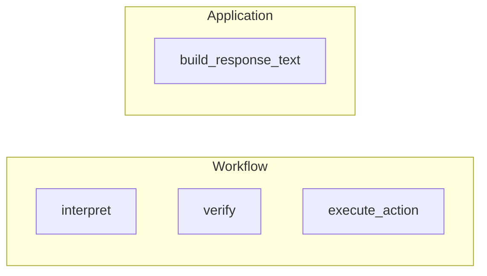

# LLM boundary

This guide explains how language models participate in the appointment bot. The runtime is designed so correctness, authorization, and state changes do not depend on nondeterministic model output.

## 1. Design principle

The LLM is non-authoritative. It performs exactly one product role:

1. **Intent extraction** — parse the user message into a structured operation label and entity fields.

The model cannot grant or deny access, mutate appointments or identity state, or decide graph routing. Final patient-facing response wording is produced deterministically by `app/responses.py` and is not rewritten by the model. Security-sensitive and policy outcomes are computed from explicit rules and repository operations, not from free-form LLM text.

## 2. Provider surface

`OpenAIProvider` in `app/llm/provider.py` exposes two methods:

| Method | Role |
|--------|------|
| `interpret(message, state) -> IntentPrediction` | Propose `requested_operation`, `full_name`, `phone`, `dob`, `appointment_reference` from the message and a small state snapshot, including a bounded recent message history. |
| `judge(scenario, transcript, observed_outcomes) -> JudgeResult` | Used by the evaluation harness; not part of the live chat graph. |

`IntentPrediction` and `JudgeResult` are Pydantic models in `app/llm/schemas.py`. They constrain what the implementation may return and keep the boundary typed.

## 3. Runtime construction

`build_provider` in `app/runtime.py` constructs the provider from `Settings`. It returns `OpenAIProvider` when `ProviderSettings.provider_name` is `"openai"` and `ProviderSettings.api_key` is present. Those values come from environment configuration (`LLM_PROVIDER` defaults to `openai`; `OPENAI_API_KEY` supplies the key). If configuration is missing or unsupported, runtime startup fails fast.

## 4. Runtime behavior

- **`interpret`** delegates action and entity extraction to the configured provider.
- **`build_response_text()`** returns deterministic patient-facing text directly. No provider call is made for response rendering.
- Verification, appointment ownership, idempotency, issue classification, and workflow routing stay in deterministic Python code outside the provider.

## 5. Prompt design

One system prompt for the live chat graph:

**Intent** (`app/llm/prompt.py`, `INTENT_PROMPT`):

```text
Return strict JSON with keys requested_operation, full_name, phone, dob, appointment_reference.
Use only these requested_operation values:
- verify_identity
- list_appointments
- confirm_appointment
- cancel_appointment
- help
- unknown
Do not decide authorization or mutate appointment state.
Leave unknown fields as null.
Recent messages may be provided in state.messages. Use them only to resolve references in the current user message.
Do not invent a new request from history alone.
If the message asks to confirm or cancel an appointment by number, treat the number as patient-facing and 1-indexed.
```

`OpenAIProvider` uses native OpenAI structured parsing against the Pydantic models `IntentPrediction` and `JudgeResult`. The provider also retries a small number of transient parse or transport failures before surfacing an error. The intent prompt explicitly steers the model away from authorization and policy decisions; the judge path uses its own minimal structured schema for eval-only calls.

## 6. LLM vs deterministic flow map

The provider is called once per turn, inside the workflow boundary.



| Stage | LLM | Deterministic |
|------|-----|---------------|
| `interpret` | Yes | No |
| `verify` | No | Yes |
| `execute_action` | No | Yes |
| `build_response_text()` | No | Yes |

## 7. Why not a ReAct agent

For this use case, a ReAct agent would give the model too much control over a workflow that is mostly policy-driven. The critical decisions are whether the patient is verified, whether an appointment belongs to that patient, whether a mutation is idempotent, and whether the session is locked. Those decisions are deterministic and easy to encode directly in Python, which makes the system easier to test, reason about, and defend against prompt-injection attempts. The chosen design keeps the model useful at the boundaries without turning it into the workflow authority.

## 8. Error isolation and retries

Tracing failures do not abort the request path. Provider failures are now handled as controlled application-level errors.

`OpenAIProvider.interpret()` is the only provider call in the live chat path. If `interpret()` raises after exhausting its internal retries, the interpret node catches the exception, logs it as `interpret_provider_failed`, and raises `DependencyUnavailableError`. That error propagates out of the LangGraph workflow and is mapped to HTTP 503 by the `/chat` route handler with the message *"The appointment service is temporarily unavailable."*

No deterministic fallback interpretation is implemented. The turn is not continued using heuristic parsing — the request is aborted cleanly and the caller receives a stable temporary-unavailable response.

Response rendering cannot produce provider errors because it is fully deterministic.
