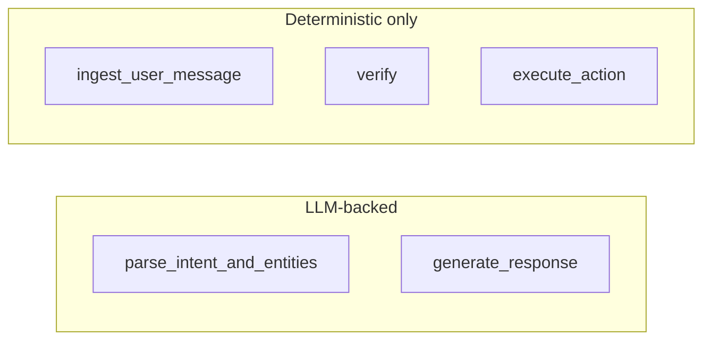

# LLM boundary

This document describes how language models participate in the appointment bot. The runtime is designed so that correctness, authorization, and state changes do not depend on nondeterministic model output.

## 1. Design principle

The LLM is non-authoritative. It performs exactly two product roles:

1. **Intent extraction** — parse the user message into a structured action label and entity fields.
2. **Response polishing** — rewrite deterministic template strings into concise, natural patient-facing wording.

The model does not grant or deny access, does not mutate appointments or identity state, and does not decide graph routing. Those responsibilities stay in deterministic Python code paths. Security-sensitive and policy outcomes are computed from explicit rules and repository operations, not from free-form LLM text.

## 2. Provider protocol

`LLMProvider` in `app/llm/base.py` is a `Protocol` with three methods:

| Method | Role |
|--------|------|
| `interpret(message, state) -> IntentPrediction` | Propose `requested_action`, `full_name`, `phone`, `dob`, `appointment_reference` from the message and a small state snapshot. |
| `generate_response(state, fallback_text) -> AssistantResponse` | Produce polished `response_text` from the deterministic `fallback_text` and state context. |
| `judge(scenario, transcript, observed_outcomes) -> JudgeResult` | Used by the evaluation harness; not part of the live chat graph. |

`IntentPrediction`, `AssistantResponse`, and `JudgeResult` are Pydantic models in `app/llm/schemas.py`. They constrain what the implementation may return and keep the boundary typed.

## 3. Factory pattern

`build_provider` in `app/llm/factory.py` constructs a concrete provider from `Settings`. It returns `OpenAIProvider` when `ProviderSettings.provider_name` is `"openai"` and `ProviderSettings.api_key` is present. Those values come from environment configuration (`LLM_PROVIDER` defaults to `openai`; `OPENAI_API_KEY` supplies the key). If configuration is missing or unsupported, the factory raises and runtime startup fails fast.

## 4. Runtime behavior

- **`parse_intent_and_entities`** delegates action and entity extraction to the configured provider.
- **`generate_response`** sends the current response text and state context to the provider for the final patient-facing wording.
- Verification, appointment ownership, idempotency, and graph routing stay in deterministic Python code outside the provider.

Provider calls are no longer wrapped in local fallback logic. If the provider raises, the failure propagates instead of silently degrading to deterministic behavior.

## 5. Prompt design

Two system prompts, kept short and task-scoped:

**Intent** (`app/prompts/intent_prompt.py`, `INTENT_PROMPT`):

```text
Return strict JSON with keys requested_action, full_name, phone, dob, appointment_reference.
Use only these requested_action values:
- verify_identity
- list_appointments
- confirm_appointment
- cancel_appointment
- help
- unknown
Do not decide authorization or mutate appointment state.
```

**Response** (`app/prompts/response_prompt.py`, `RESPONSE_PROMPT`):

```text
Return strict JSON with key response_text.
Keep the wording concise and patient-facing.
Do not invent new actions, permissions, or workflow outcomes.
```

`OpenAIProvider._complete` in `app/llm/openai_provider.py` passes `response_format={"type": "json_object"}` on chat completions so the API returns parseable JSON. The intent and response prompts explicitly steer the model away from authorization and policy decisions; the judge path uses its own minimal JSON instruction for eval-only calls.

## 6. LLM vs deterministic node map

Only two LangGraph nodes invoke the provider directly.



| Node | LLM | Deterministic |
|------|-----|---------------|
| ingest_user_message | No | Yes |
| parse_intent_and_entities | Yes | No |
| verify | No | Yes |
| execute_action | No | Yes |
| generate_response | Yes | Yes (upstream business outcome only) |

## 7. Error isolation

Tracing failures do not abort the graph, but provider failures now do. The `interpret` and `generate_response` node implementations call the provider directly, so provider exceptions surface as runtime errors instead of being converted into degraded chat responses.
