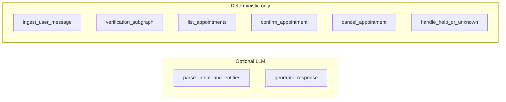

# LLM boundary

This document describes how language models participate in the appointment bot. The runtime is designed so that correctness, authorization, and state changes do not depend on nondeterministic model output.

## 1. Design principle

The LLM is non-authoritative. It performs exactly two product roles:

1. **Intent extraction** — parse the user message into a structured action label and entity fields.
2. **Response polishing** — rewrite deterministic template strings into concise, natural patient-facing wording.

The model does not grant or deny access, does not mutate appointments or identity state, and does not decide graph routing. Those responsibilities stay in deterministic Python code paths. Security-sensitive and policy outcomes are computed from explicit rules and repository operations, not from free-form LLM text.

## 2. Provider protocol

`LLMProvider` in `app/llm/base.py` is a `Protocol` with three methods:

| Method | Role |
|--------|------|
| `interpret(message, state) -> IntentPrediction` | Propose `requested_action`, `full_name`, `phone`, `dob`, `appointment_reference` from the message and a small state snapshot. |
| `generate_response(state, fallback_text) -> AssistantResponse` | Produce polished `response_text` from the deterministic `fallback_text` and state context. |
| `judge(scenario, transcript, observed_outcomes) -> JudgeResult` | Used by the evaluation harness; not part of the live chat graph. |

`IntentPrediction`, `AssistantResponse`, and `JudgeResult` are Pydantic models in `app/llm/schemas.py`. They constrain what the implementation may return and keep the boundary typed.

## 3. Factory pattern

`build_provider` in `app/llm/factory.py` constructs a concrete provider from `Settings`. It returns `OpenAIProvider` only when `ProviderSettings.provider_name` is `"openai"` and `ProviderSettings.api_key` is set. Those values come from environment configuration (`LLM_PROVIDER` defaults to `openai`; `OPENAI_API_KEY` supplies the key). In all other cases the function returns `None`.

When `build_provider` returns `None`, the graph is wired with no provider. Behavior is unchanged in structure: the same nodes run; only the optional LLM branches are skipped.

## 4. Deterministic fallback

### No provider (`provider is None`)

- **`parse_intent_and_entities`** uses `policies.extract_requested_action` in `app/domain/policies.py` for the action label, plus `extract_phone`, `extract_dob`, `extract_full_name`, and (when the flow needs it) `extract_appointment_reference` for entities. No model call.
- **`generate_response`** leaves `response_text` as produced by upstream nodes (the deterministic template). No polishing.

The test suite runs with `provider=None`, which demonstrates that listing, verification, confirm, cancel, and help paths complete end-to-end without any LLM.

### With a provider

- **`parse_intent_and_entities`**: Deterministic `extract_requested_action` runs first. If it yields `unknown`, the provider may set a different `requested_action`. The provider may also supply PII or `appointment_reference` when deterministic extraction or state did not already fill those fields. Regex-based extraction in the same node still runs and can fill gaps the model missed.
- **`generate_response`**: The provider receives the current deterministic `response_text` as `fallback_text` and returns polished text. Prompting instructs the model not to invent actions, permissions, or workflow outcomes; the OpenAI implementation also appends a line reinforcing that constraint.

Both nodes wrap provider calls in `try/except` for broad `Exception`. On failure, `provider_error` is set (`interpret_failed` or `response_failed`), `error_code` is set to `provider_fallback` if not already set, and the workflow continues with the deterministic values already on state.

## 5. Prompt design

Two system prompts, kept short and task-scoped:

**Intent** (`app/prompts/intent_prompt.py`, `INTENT_PROMPT`):

```text
Return strict JSON with keys requested_action, full_name, phone, dob, appointment_reference.
Use only these requested_action values:
- verify_identity
- list_appointments
- confirm_appointment
- cancel_appointment
- help
- unknown
Do not decide authorization or mutate appointment state.
```

**Response** (`app/prompts/response_prompt.py`, `RESPONSE_PROMPT`):

```text
Return strict JSON with key response_text.
Keep the wording concise and patient-facing.
Do not invent new actions, permissions, or workflow outcomes.
```

`OpenAIProvider._complete` in `app/llm/openai_provider.py` passes `response_format={"type": "json_object"}` on chat completions so the API returns parseable JSON. The intent and response prompts explicitly steer the model away from authorization and policy decisions; the judge path uses its own minimal JSON instruction for eval-only calls.

## 6. LLM vs deterministic node map

Only two LangGraph nodes may invoke the provider. All nodes still execute deterministic logic first or exclusively.



| Node | LLM | Deterministic |
|------|-----|---------------|
| ingest_user_message | No | Yes |
| parse_intent_and_entities | Optional | Yes (always runs) |
| verification_subgraph | No | Yes |
| list_appointments | No | Yes |
| confirm_appointment | No | Yes |
| cancel_appointment | No | Yes |
| handle_help_or_unknown | No | Yes |
| generate_response | Optional | Yes (fallback) |

## 7. Error isolation

Provider failures do not abort the graph. The `interpret` and `generate_response` node implementations catch exceptions from the provider, record `provider_error`, and preserve deterministic state and `response_text` as described above.

The API exposes `error_code` from the final graph state (for example `provider_fallback` when the provider failed and the run fell back). Clients can use that field to detect degraded LLM availability without treating the request as a hard failure.
